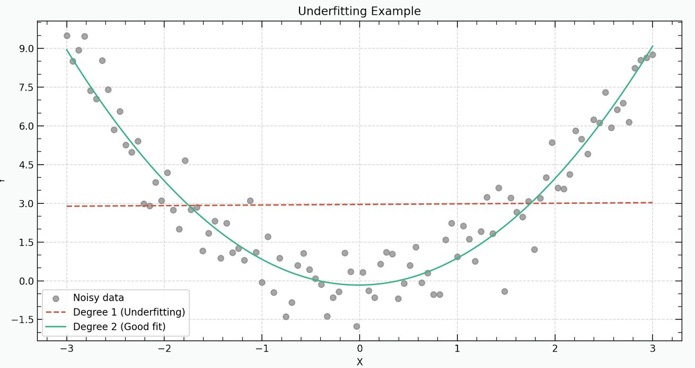
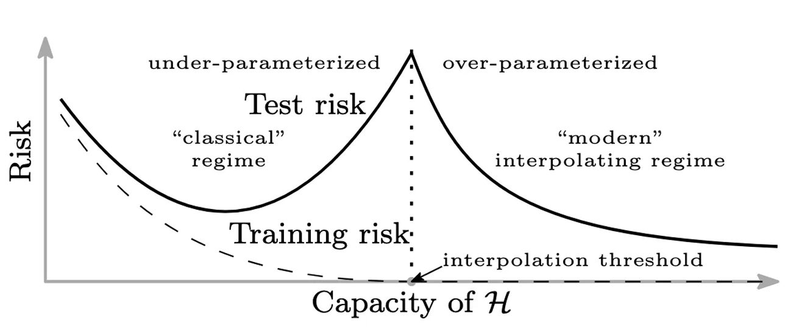

#  Standford CS229 2022Fall，第9讲：偏差-方差、正则化

## 思维导图


## 引言

首先介绍一些会使用到的名词：

*   **训练损失/误差/代价 (training loss/ error/ cost)**: 指训练期间训练数据的误差：
    $$ J(\theta) = \frac{1}{n} \sum_{i=1}^{n} (y^{(i)} - h_\theta(x^{(i)}))^2 $$
*   **测试损失/误差/代价 (testing loss/ error/ cost)**: 指测试期间测试数据的误差：
    $$ L(\theta) = E_{(x,y) \sim D}[(y - h_\theta(x))^2] $$
    其中 $\theta$ 为训练得到的模型参数，$(x, y) \sim D$ 指测试数据 $(x, y)$ 满足分布 $D$，并且测试数据不能包含测试数据集中数据。由于对分布求期望只能理论上的写出来，在实际中，是使用足够多的 i.i.d. 样本 $(x^{(1)}_{test}, y^{(1)}_{test}), ..., (x^{(m)}_{test}, y^{(m)}_{test}) \overset{i.i.d.}{\sim} D$ 进行计算。
*   **泛化差距 (Generation gap)**: 指测试误差与训练误差之间的差距：
    $$ \text{Generation gap: } L(\theta) - J(\theta) $$
    *注1*: 泛化差距可以用于评估训练是否过拟合/欠拟合等情况。一般来说 $L(\theta) - J(\theta) \geqslant 0$，现实情况中一般不会出现 $J(\theta) > L(\theta)$ 的情况。我们期望的情况是 $J(\theta)$ 和 $L(\theta) - J(\theta)$ 都很小，但是由于二者分属两个过程，故同时控制二者是很困难的，因此泛化差距不能够直接控制也很难控制。

## 偏差-方差理论

### 2 失败模式

当 $L(\theta)$ 较小时，认为模型的泛化性能较好，因此我们并不希望 $L(\theta)$ 很大，但是当出现这种情况时，一般有两种情形：

1.  **过拟合 (overfitting)**：此时 $J(\theta) \approx 0$ 很小，但是 $L(\theta)$ 很大，说明训练得到的模型过于逼近训练数据，对于新的数据泛化能力很差。
2.  **欠拟合 (underfitting)**：此时 $J(\theta)$ 也很大，说明模型对训练数据都没有很好拟合。

当发生过拟合时，说明模型学习到的并非真实的数据满足的模式，而是学习到了噪声的 “spurious pattern”，因此为检测模型是否过拟合可以通过重新提取 (redrawn) 数据训练，若发生了过拟合那么不同数据训练得到的模型会有很大差异。
> 
> 图1: 欠拟合示例

## 偏差和方差

偏差-方差理论用于定性分析已训练模型的测试误差 $L(\theta)$。其将测试误差分解为偏差与方差两部分的和，用于解释模型复杂度 $a$ 与 $L(\theta)$ 的关系，在理论上可以证明：
$$ L(\theta) = \text{bias}^2 + \text{variance} \quad (1) $$
其中偏差定义为在数据量无限的前提下模型可以实现的最小误差；方差定义为选用的模型在不同数据集上的表现带来的差异性大小（类似于不稳定性的衡量，类比方差）。

*   偏差主要由模型表达能力过低导致，而与训练数据量关系不大。
*   方差主要由两个原因导致：1. 数据量少；2. 模型表达能力过强。相应地减小方差的方法有：1. 增加更多训练数据；2. 使用更简单的模型。一般来说训练时都会将所有数据用于训练，因此主要讨论后者。

偏差-方差理论指出偏差随模型复杂度递增而递减，方差随模型复杂度递增而增加，因此二者求和后的测试误差 $L(\theta)$ 会随模型复杂度先增加后减少，意味着从欠拟合向过拟合转变，如下图所示：
> 
> 图2: 偏差-方差分解

$a$ 模型复杂度指模型的复杂程度，可以简单理解为参数量，例如简单线性模型、二次多项式模型、五次多项式模型、神经网络模型的模型复杂度在递增。

## 双下降现象 (Double decent)

双下降现象是机器学习与深度学习中非常重要的现象，其最早的观察可以追溯到1989年 Vallet et al. (1989)，在2019年重新被提出 Belkin et al. (2019)，并且成为近期的研究热门。一般认为，随着模型的复杂度上升，会从欠拟合向过拟合转变，因此测试误差会先降低再上升，但是双下降现象说明，如果继续增加模型复杂度，测试误差在达到一个顶点时会“反常地”开始下降（如图3所示），此时模型会得到很好的泛化能力。
> 
> 图3: Belkin et al. (2019) 中展示的双下降现象，其中 H 是模型/函数。

*注2*: 对于双下降现象，有如下几点说明：
1.  训练误差 (risk) 第二次下降时（图中标记为 interpolation threshold）一般是数据量与参数量相等时，即 $n \approx d$，其中 $n = \#$ parameters, $d = \#$ data points。当 $n > d$ 后 risk 开始再次下降。
2.  实际上还有一种按数据量划分的双下降 (data-wise double decent)，是指横坐标为 $\#$ data points，其二次下降的临界点仍然一般是 $n \approx d$。Nakkiran et al. (2021)
3.  简单的模型也可以有很大的模型参数量或模型复杂度，例如对于线性模型，使用核方法可以使其同样拥有很大参数量。

### 双下降现象的一些解释

当模型的参数量与训练数据量相近，即 $n \approx d$ 时，模型的泛化性能会急剧下降。可以从如下两个方面解释（只说明结论，不说明原理）：

1.  模型的参数 $\theta$ 的范数 (norm) 随着参数量 ($\#$ parameters) 的上升是先上升后下降的趋势，而最大 norm 存在于 $n \approx d$ 时，这也导致了此时模型性能很差，因此我们可以尽量选择一个 $\theta$ 的 norm 小的模型。当 $n \gg d$ 时优化算法存在隐式正则化 (implicit regularization effect) 使得 norm 变小。
2.  更深层次来说，原因在于模型训练过程中产生的某些随机矩阵 (random matrix) 在 $n \approx d$ (近似于方阵) 时表现不佳。若有兴趣更深层次的原因可以参见 Mei and Montanari (2022)。

此外，对于 norm，其可以作为衡量模型复杂度 (complexity) 的一种指标，但是并不唯一，也很难说是不是最好的度量指标。同样地，$\#$ parameters 也说不好是不是最好的指标，因为在训练过程中，很可能很多的参数的系数会趋于 0。

## 代码

```python
import numpy as np
import matplotlib.pyplot as plt

# Set seed for reproducibility
np.random.seed(42)

# Generate training data
x = np.linspace(-3, 3, 100)
y_true = x**2 # True function(quadratic)
noise = np.random.normal(0, 1, size=x.shape)# Gaussian noise
y = y_true + noise # Add noise to the true function

# Polynomial fitting(degree 1, 2, 3)
degree_1 = np.polyfit(x, y, 1)
degree_2 = np.polyfit(x, y, 2)

# Create a smooth line for plotting
x_smooth = np.linspace(-3, 3, 500)
y_true_smooth = np.polyval([0, 0, 1], x_smooth)# Interpolated true function

y_1 = np.polyval(degree_1, x_smooth)
y_2 = np.polyval(degree_2, x_smooth)

# Plot the results
fig, ax = plt.subplots(figsize=(12, 6), dpi= 200)

# Plot true function and noisy data
plt.scatter(x, y, color='gray', label='Noisy data', alpha=0.7)

# Plot polynomial fits
plt.plot(x_smooth, y_1, color=colors["hong"], label='Degree 1(Underfitting )', linestyle='--')
plt.plot(x_smooth, y_2, color=colors["mint"], label='Degree 2(Good fit)', linestyle='-')

# Labels and title
plt.xlabel('X')
plt.ylabel('Y')
plt.title('Underfitting Example')
plt.legend()

# grid
ax.grid(
    linestyle="--",
    linewidth=0.8,
    color="gray",
    alpha=0.3
)

ax.xaxis.set_major_locator(plt.MultipleLocator(1))
ax.xaxis.set_minor_locator(plt.MultipleLocator(0.2))
ax.yaxis.set_major_locator(plt.MultipleLocator(1.5))
ax.yaxis.set_minor_locator(plt.MultipleLocator(0.5))
ax.tick_params(axis='x', which='major', length=7)
ax.tick_params(axis='x', which='minor', length=4)
ax.tick_params(axis='y', which='major', length=7)
ax.tick_params(axis='y', which='minor', length=4)

ax.tick_params(axis='x', which='both', top=True, direction='in')
ax.tick_params(axis='y', which='both', right=True, direction='in')

# Set transparent background
plt.gcf().set_facecolor('none')

# Show the plot
plt.savefig("underfitting.png", dpi= 200)
plt.show()
```

## 参考文献

*   Mikhail Belkin, Daniel Hsu, Siyuan Ma, and Soumik Mandal. Reconciling modern machine-learning practice and the classical bias–variance trade-off. Proceedings of the National Academy of Sciences, 116(32):15849–15854, 2019.
*   Song Mei and Andrea Montanari. The generalization error of random features regression: Precise asymptotics and the double descent curve. Communications on Pure and Applied Mathematics, 75(4):667–766, 2022.
*   Preetum Nakkiran, Gal Kaplun, Yamini Bansal, Tristan Yang, Boaz Barak, and Ilya Sutskever. Deep double descent: Where bigger models and more data hurt. Journal of Statistical Mechanics: Theory and Experiment, 2021(12):124003, 2021.
*   F Vallet, J-G Cailton, and Ph Refregier. Linear and nonlinear extension of the pseudo-inverse solution for learning boolean functions. Europhysics Letters, 9(4):315, 1989.