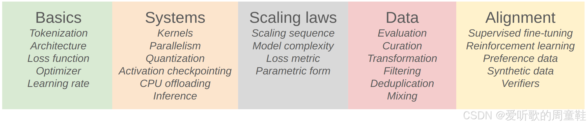
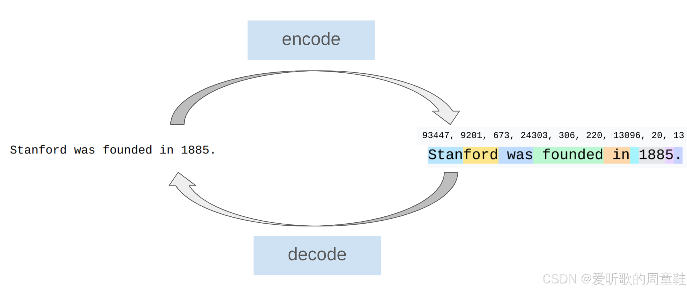
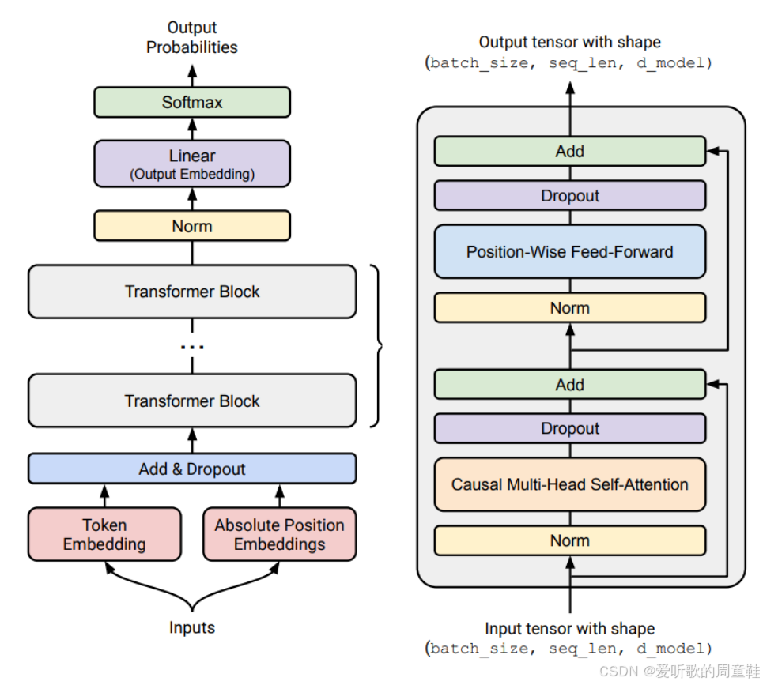

## Lecture 1 ：概述和分词Tokenization
### 1. Course Introduction
#### CS336 这门课程讲的是什么？
语言模型是现代自然语言处理（NLP）应用的基石，它开创了一种新的范式，即用一个通用系统处理一系列下游任务。随着人工智能（AI）、机器学习（ML）和 NLP 领域的不断发展，深入理解语言模型对科学家和工程师而言都至关重要。本课程通过引导学生亲手构建语言模型，提供系统化的学习路径。借鉴操作系统课程从零创建操作系统的教学模式，我们将带领学生完整经历语言模型创建的全流程：涵盖预训练阶段的数据采集与清洗、Transformer 模型的构建、模型训练以及部署前的评估

### 2. Overview
整个课程分为以下五个部分：

#### 2.1 Basics Unit
Basics 基础单元的目标就是让完整流程的基础版本正常运行，在这里，你将学习分词（tokenization）、模型架构和训练过程。

1. 分词器 Tokenizer
    **tokenizer 分词器是一种能在字符串和整数序列（tokens）之间进行转换的东西**
    

    简单来说，你可以把这些整数看作是对应于将字符串分解成一个个小片段（token），然后将每一个小片段映射到一个整数。
    这样做的想法是，你的整数序列就是输入到实际模型中的内容，而这个模型必须是固定维度的。

    在本次课程中，我们将讨论字节对编码（Byte-Pair Encoding, BPE）分词器 [Sennrich+ 2015](https://arxiv.org/pdf/1508.07909)，它相对简单，并且目前仍在被使用。

    > 关于 “无分词器”，目前也有一系列很有前景的方法 [[Xue+ 2021]](https://arxiv.org/pdf/2105.13626)、[[Yu+ 2023]](https://arxiv.org/pdf/2305.07185)、[[Pagnoni+ 2024]](https://arxiv.org/pdf/2412.09871)、[[Deiseroth+ 2024]](https://arxiv.org/pdf/2412.09871)。
    > 
    > 这些方法直接处理原始字节，而不进行分词，通过开发一种特定的架构来直接接收原始字节。

2. 模型架构 - Transformer
    一旦你将序列或字符串分词成整数序列后，就可以在这类序列上定义一个模型架构，我们从原始的 Transformer 模型开始 [[Vaswani+ 2017]](https://arxiv.org/pdf/1706.03762)

    

    Transformer 基本上是所有前沿模型的核心骨干，上图展示的是它的架构。

    自 2017 年以来其实发生了很多变化，关于 Transformer 有很多小改进，例如：

    - 激活函数：ReLU，SwiGLU [Shazeer 2020]
    - 位置编码：sinusoidal，RoPE [Su+ 2021]
    - 归一化：LayerNorm，RMSNorm [Ba+ 2016][Zhang+ 2019]
    - 归一化位置：pre-norm vs post-norm [Xiong+ 2020]
    - MLP：dense，mixture of experts [Shazeer+ 2017]
    - Attention：full，sliding window，linear [Jiang+ 2023][Katharopoulos+ 2020]
    - Lower-dimensional attention：group-query attention (GQA)，multi-head latent attention (MLA) 
    - [Ainslie+ 2023][DeepSeek-AI+ 2024]
    状态空间模型：Hyena [Poli+ 2023]