## L1：Self-Attention

### **一、引入：从处理向量到处理向量集**

#### **1. 核心挑战**
在深度学习的许多任务中，我们面临的挑战不再是处理固定大小的单个向量输入，而是处理一个**向量集合（a set of vectors）**，并且这个集合的大小（即向量的数量）是可变的。

#### **2. 什么时候的输入是a set of vectors**
a. **自然语言处理 (NLP)**
   - **One-hot Encoding**: 每个词被表示为一个高维稀疏向量。
   - **Word Embedding**: 每个词被表示为一个低维稠密向量。
   
b. **声音信号**
   - 一个音频片段可以被看作是一个声学特征向量（Acoustic Feature Vector）的序列。

c. **图 (Graph)**
   - 图中的每个节点（node）都可以被表示为一个向量，例如在社交网络或化学分子结构中。

#### **3. a set of vectors的模型输出是什么**
a. **为每个向量都生成一个标签 (Sequence Labeling)**
   - **例子**: 词性标注 (Part-of-Speech Tagging)，为句子中的每个单词标注其词性（名词、动词、形容词等）。

b. **为整个向量集生成一个标签 (Classification/Regression)**
   - **例子**: 情感分析 (Sentiment Analysis)，判断整个句子的情感是积极的还是消极的。

c. **由模型自行决定输出标签的数量**
   - **例子**: 序列到序列 (Seq2seq) 任务，如机器翻译，输入和输出的序列长度可能不同。

### **二、传统方法的局限性**

当我们处理序列标注（Sequence Labeling）这类任务时，最直观的想法是：

a. **直接使用全连接网络 (FCN)**
   - **方法**: 将每个词向量独立地输入到一个全连接网络中，生成对应的输出。
   - **问题**: 这种方法完全忽略了词与词之间的上下文关系。例如，在 "I saw a saw" 中，FCN无法区分第二个 "saw" 是一个名词（工具）而不是动词。

b. **使用固定大小的窗口 (Window-based FCN)**
   - **方法**: 在处理一个词时，将其和它周围的几个词（例如，前后各2个词）拼接起来，一同输入到FCN中。
   - **问题**: 窗口大小是固定的，无法灵活地处理可变长度的上下文依赖。对于长距离的依赖关系，这种方法会失效。

为了解决以上问题，我们需要一种能够动态考虑整个序列上下文信息的机制，Self-Attention应运而生。

### **三、Self-Attention 机制详解**

Self-Attention的核心思想是，在处理序列中的某一个元素时，让它去“关注”序列中所有其他的元素，并根据相关性（注意力分数）来决定应该赋予每个元素多少权重，然后将这些元素加权融合，形成该元素新的表示。

#### **1. 整体框架**

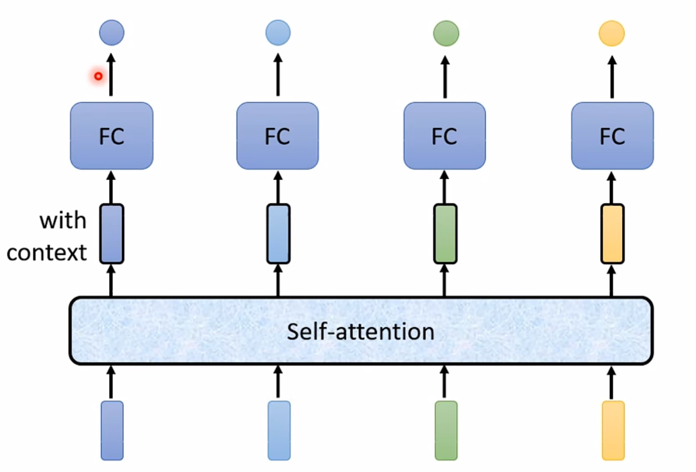

输入是一系列的向量（例如$a^1, a^2, a^3, a^4$），通过Self-Attention层后，输出另一组同样数量的向量（$b^1, b^2, b^3, b^4$）。输出向量$b^i$考虑了所有输入向量的信息。

#### **2. 计算过程：Query, Key, Value (Q, K, V)**

为了计算输出向量 $b^1$，模型需要执行以下步骤。首先，Self-Attention引入了三个非常重要的概念：**Query (查询)**, **Key (键)**, 和 **Value (值)**。

每个输入向量 $a^i$ 都会通过乘以三个不同的、可学习的权重矩阵 ($W^q$, $W^k$, $W^v$) 来生成对应的 $q^i$, $k^i$, $v^i$ 三个向量。

- **Query ($q^i$)**: 代表了当前向量为了和其他向量匹配而提出的“查询”。
- **Key ($k^i$)**: 代表了当前向量用于被其他向量匹配的“键”。
- **Value ($v^i$)**: 代表了当前向量实际包含的“信息”。

#### **3. 详细计算步骤**

**① 计算注意力分数 (Attention Score)**

以计算 $b^1$ 为例，我们需要用 $a^1$ 的查询向量 $q^1$ 去和序列中**所有**输入向量的键向量 $k^1, k^2, k^3, ...$ 进行匹配，从而计算出 $a^1$ 对其他所有 $a^i$ 的注意力分数 $\alpha_{1,i}$。

- **如何计算相关度 (Score Function)**：
  - **Dot-Product (点积)**: 这是Transformer中最常用的方法。
    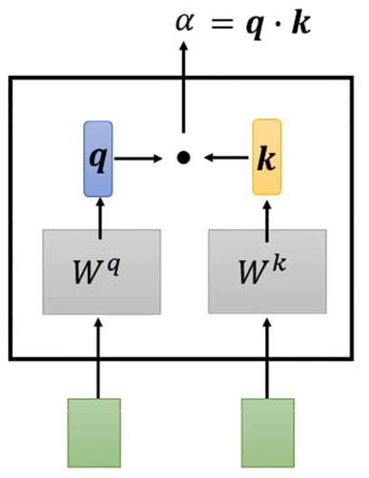
  - **Additive (加性)**: 通过一个小型的前馈网络计算。
    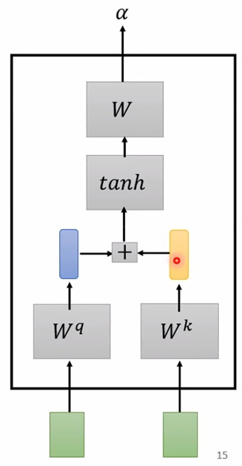

我们使用 $q^1$ 和每个 $k^i$ 计算分数：
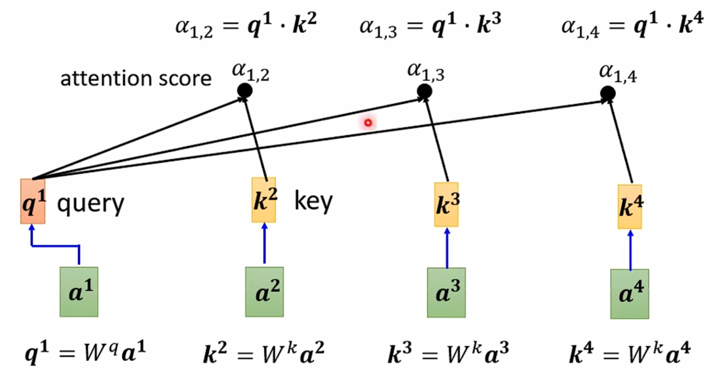

**② 对分数进行归一化 (Softmax)**

将上一步得到的分数通过一个Softmax函数进行归一化，得到最终的注意力权重 $\alpha'_{1,i}$。这些权重加起来为1，代表了在生成 $b^1$ 时，应该对每个输入向量的Value赋予多大的“关注度”。（注意：在Transformer的原始论文中，点积之后、Softmax之前会除以一个缩放因子 $\sqrt{d_k}$ 来防止梯度过小）。
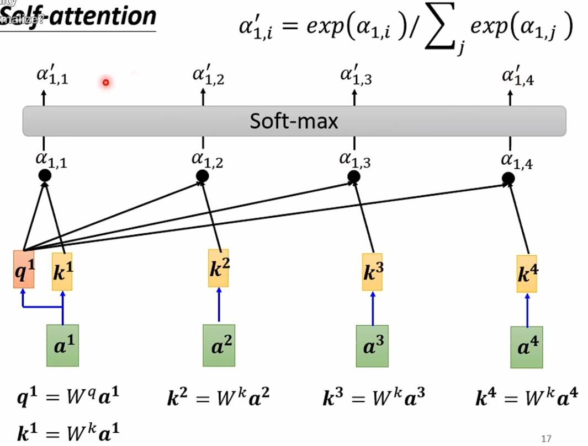

**③ 根据注意力权重加权求和**

最后，将归一化后的注意力权重 $\alpha'_{1,i}$ 与每个输入向量对应的**Value向量** $v^i$ 相乘，然后将它们全部加权求和，得到最终的输出向量 $b^1$。
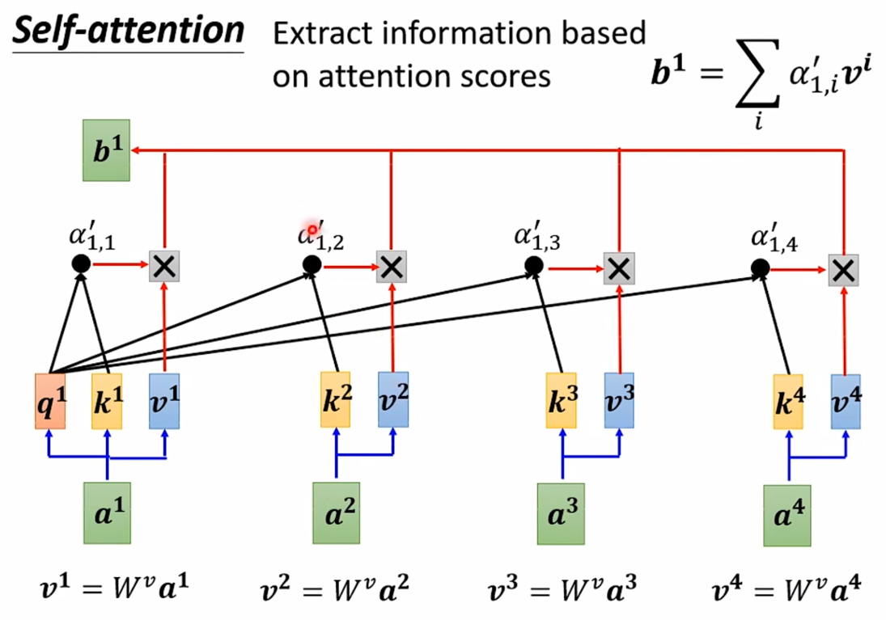

这个过程对序列中的每一个输入向量 $a^i$ 都会并行地执行一遍，从而得到完整的输出序列 $b^1, b^2, b^3, ...$。

#### **4. 计算过程：从向量到矩阵**

为了实现并行计算，实际操作中我们会将整个序列的计算过程矩阵化。

**① 生成 Q, K, V 矩阵**

将所有的输入向量$a^i$堆叠成一个输入矩阵$I$。然后用$I$分别乘以三个可学习的权重矩阵$W^q, W^k, W^v$，一次性得到所有向量的Query, Key, Value，形成$Q, K, V$三个矩阵。

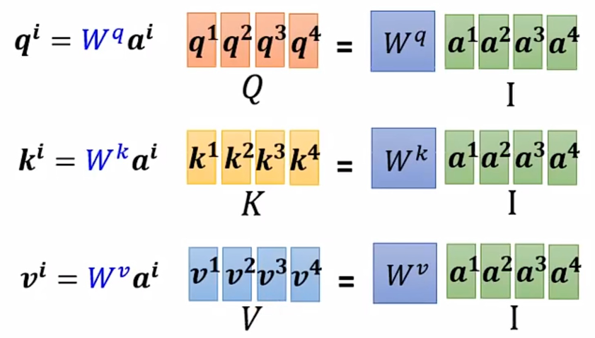

**② 计算注意力分数矩阵 A'**

通过将$K$矩阵转置后与$Q$矩阵相乘，一步就完成了所有Query和所有Key的点积运算，得到注意力分数矩阵$A$。接着，对$A$的每一列（或每一行，取决于实现方式）应用Softmax函数，得到归一化后的注意力权重矩阵$A'$。

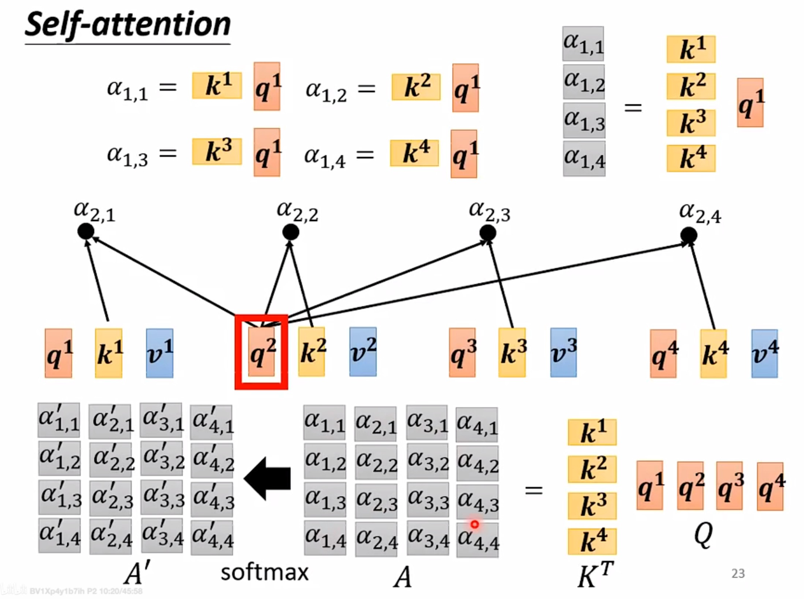

**③ 计算输出矩阵 O**
最后，将$V$矩阵与注意力权重矩阵$A'$相乘，得到最终的输出矩阵$O$。$O$的每一行就是对应位置考虑了全局上下文信息后的新向量表示。

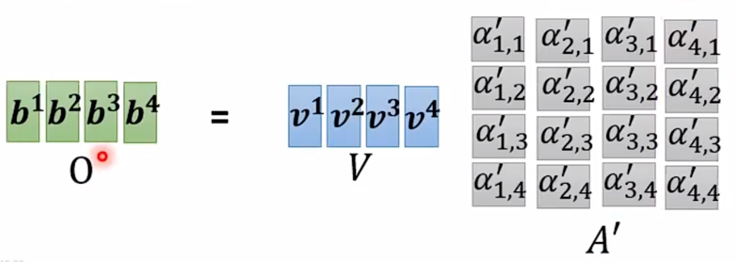

**④ 总结**

整个过程可以被简洁地表示为一个公式：
$$ \text{Attention}(Q, K, V) = \text{softmax}(\frac{QK^T}{\sqrt{d_k}})V $$
其中 $\sqrt{d_k}$ 是一个缩放因子，用于稳定梯度。

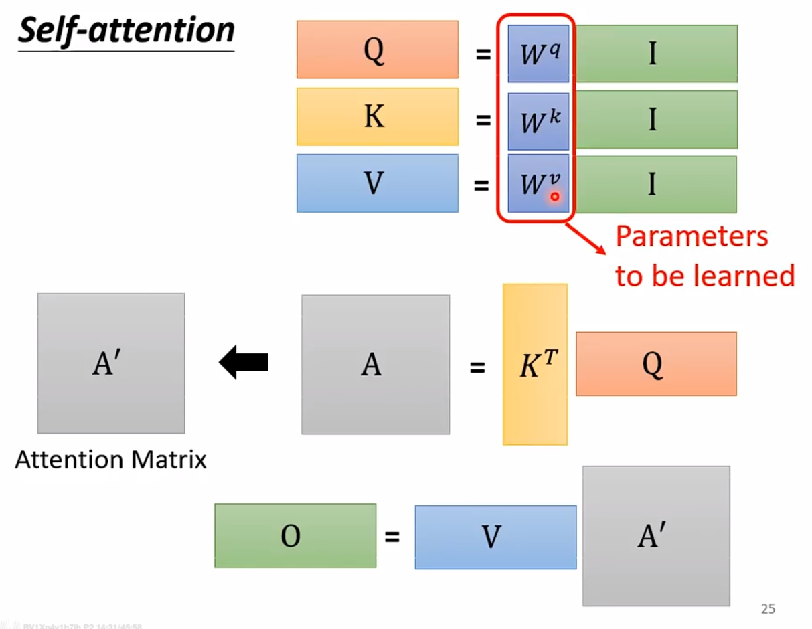

### **四、核心进阶：多头注意力与位置编码**

#### **1. Multi-Head Attention (多头注意力机制)**

单一的Self-Attention机制只让模型从一个“角度”去理解上下文。为了让模型能够捕捉到更丰富的关系（比如有的“头”关注语法，有的“头”关注语义），引入了多头注意力。

- **工作原理**: 将原始的$Q, K, V$向量在特征维度上进行切分，分解成多个更小的$q_i, k_i, v_i$。每一组$(q_i, k_i, v_i)$都被视为一个独立的“头”（Attention Head），各自并行地执行一次完整的Attention计算。
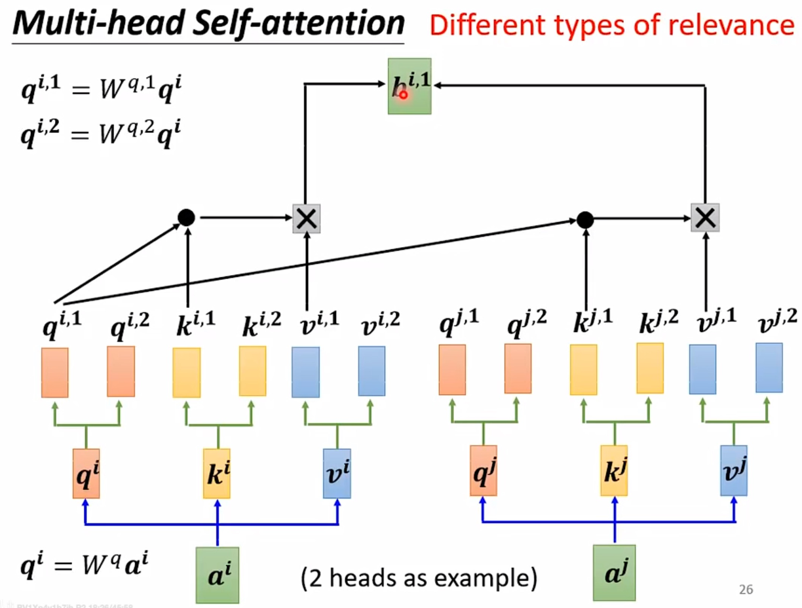
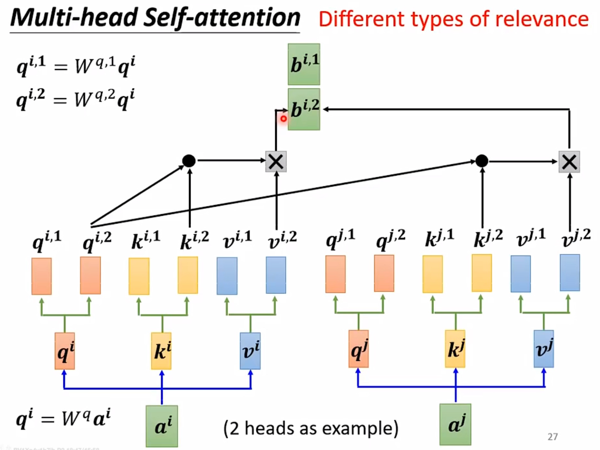

- **融合**: 将所有“头”的输出结果拼接（Concatenate）起来，再通过一个额外的线性变换（乘以权重矩阵 $W^O$）进行融合，得到最终的输出。
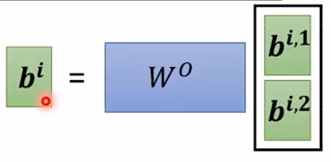

#### **2. Positional Encoding (位置编码)**

Self-Attention本身是“置换不变”的，它无法感知序列中元素的顺序。为了解决这个问题，我们需要在输入向量中加入位置信息。

- **思想**: 为序列中的每个位置$i$创建一个独一无二的位置向量$e^i$，然后将其与该位置的输入向量$a^i$相加，作为Self-Attention层的最终输入。
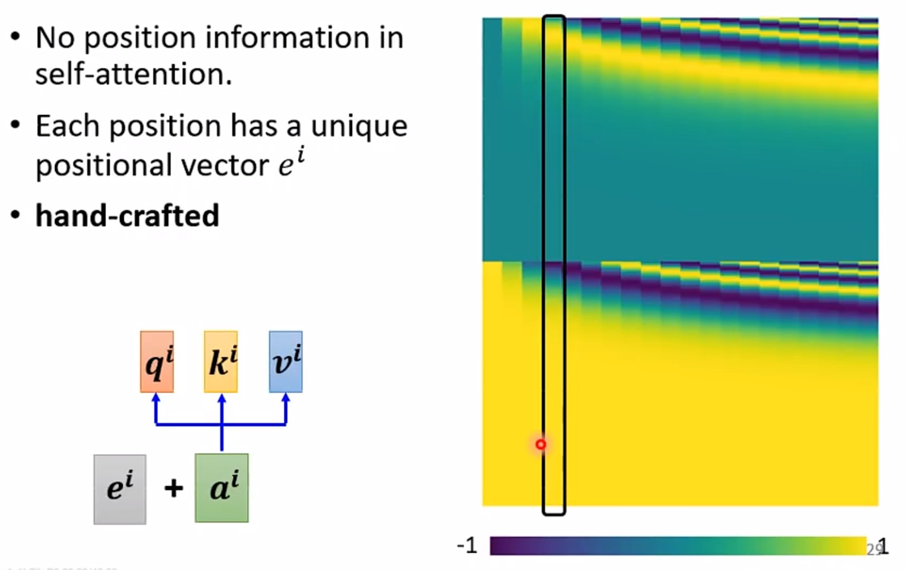

- **计算方法**:
  - **Sinusoidal**: Transformer论文中提出的方法，使用不同频率的sin和cos函数来创建位置向量，这种方法可以推广到比训练集中更长的序列。
  - **FLOATER**: 另一种基于三角函数的位置编码变体。
  - **Learned Positional Encoding**: 将位置编码也作为模型参数，通过训练学习得到。

### **五、Self-Attention的应用**

#### **1. 语音 (Speech)**
- **挑战**: 语音信号通常是非常长的向量序列，而Self-Attention的计算复杂度是输入长度$L$的平方（$O(L^2)$），这在计算上是难以承受的。
- **解决方案**: **Truncated Self-Attention**。在计算一个位置的Attention时，不考虑整个序列，而是只考虑其周围一个固定大小的窗口，从而将计算量控制在可接受的范围内。

#### **2. 图像 (Image)**
- **思想**: 一张图片可以被看作是一个由像素向量组成的集合（vector set）。每个像素（或一个patch/区域）都可以被视为序列中的一个“元素”。
- **例子**:
  - **Self-Attention GAN**: 在生成对抗网络中引入Self-Attention，帮助模型捕捉图像中远距离区域的依赖关系，生成更协调的图像。
  - **DETR (DEtection TRansformer)**: 将目标检测任务视为一个集合预测问题，使用Transformer Encoder-Decoder架构直接输出检测框集合。

#### **3. 图 (Graph)**
- **思想**: 对于图结构数据，Self-Attention可以被很自然地应用。我们只需要在计算注意力分数时，**只考虑图中相互连接的节点**。
- **例子**: 这种只在邻居节点间计算Attention的方式，本身就是**图注意力网络 (Graph Attention Network, GAT)** 的一种形式，是图神经网络（GNN）的一个重要分支。
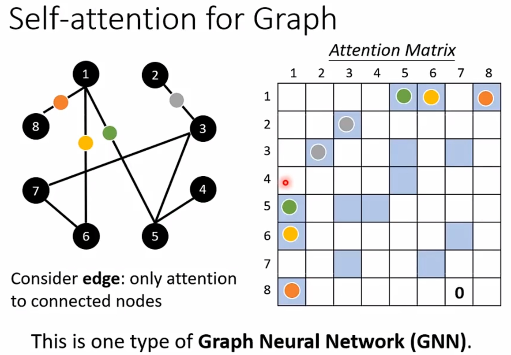

### **六、Self-Attention 与其他架构的对比**

#### **1. Self-Attention vs. CNN**
- **关系**: CNN可以被看作是一种**简化版的、固定的Self-Attention**。CNN的卷积核在整个图片上滑动，其关注的范围（receptive field）是固定的、局部的，并且权重是共享且不随输入内容变化的。而Self-Attention的“感受野”是整个序列，且注意力权重是根据输入动态计算的。
- **数据效率**:
  - **数据量较少时**: CNN的先验假设（局部性）更强，约束性更强，因此更容易训练，表现通常**更好**。
  - **数据量充足时**: Self-Attention的结构更灵活，能够从数据中学习到更复杂的关系，表现通常**更好**。
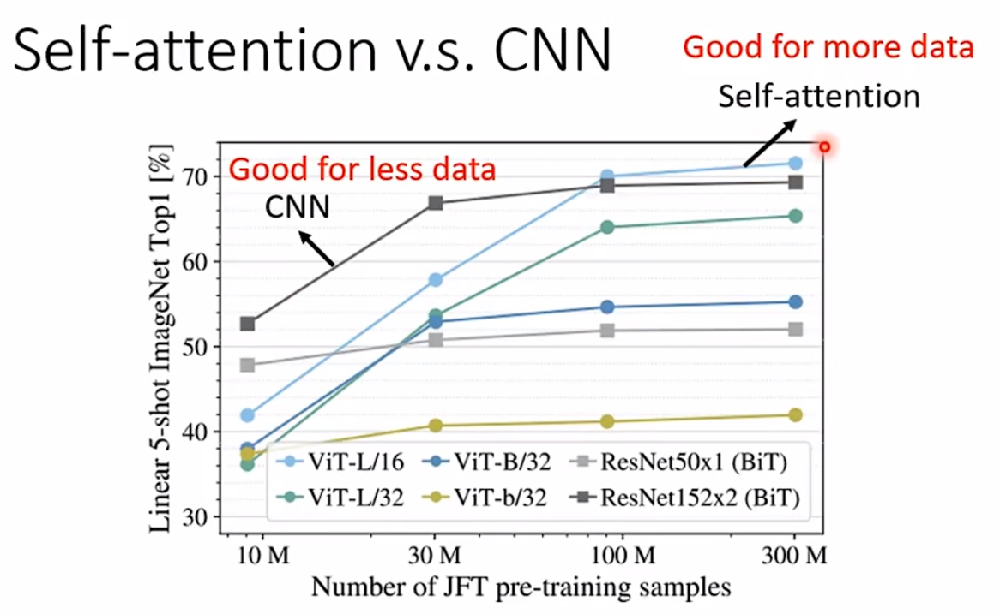

#### **2. Self-Attention vs. RNN**
- **架构对比**:
  - **RNN (循环神经网络)**: 必须按顺序处理输入，信息通过隐藏状态逐步传递。这导致了两个主要问题：**难以并行计算**，以及**长距离依赖信息容易丢失**（梯度消失/爆炸）。
  - **Self-Attention**: 可以并行处理序列中的所有元素。任意两个元素之间的路径长度都是1，因此能非常有效地捕捉长距离依赖。
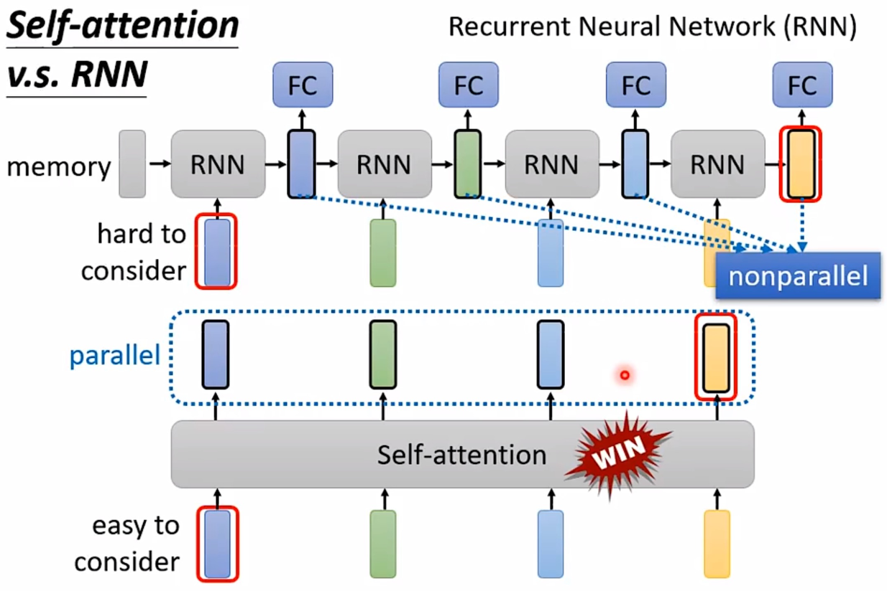
