# Transformer学习笔记

## 1. 总框架：Encoder-Decoder
Transformer的核心是一个**Encoder-Decoder**架构。
*   **Encoder (编码器):** 负责接收并处理整个输入序列（例如，一句待翻译的德语），将其“理解”并压缩成一系列富含上下文信息的向量表示（Contextualized Vectors）。
*   **Decoder (解码器):** 接收编码器的输出，并结合已经生成的部分输出序列，逐个生成目标序列的元素（例如，翻译后的英语单词）。

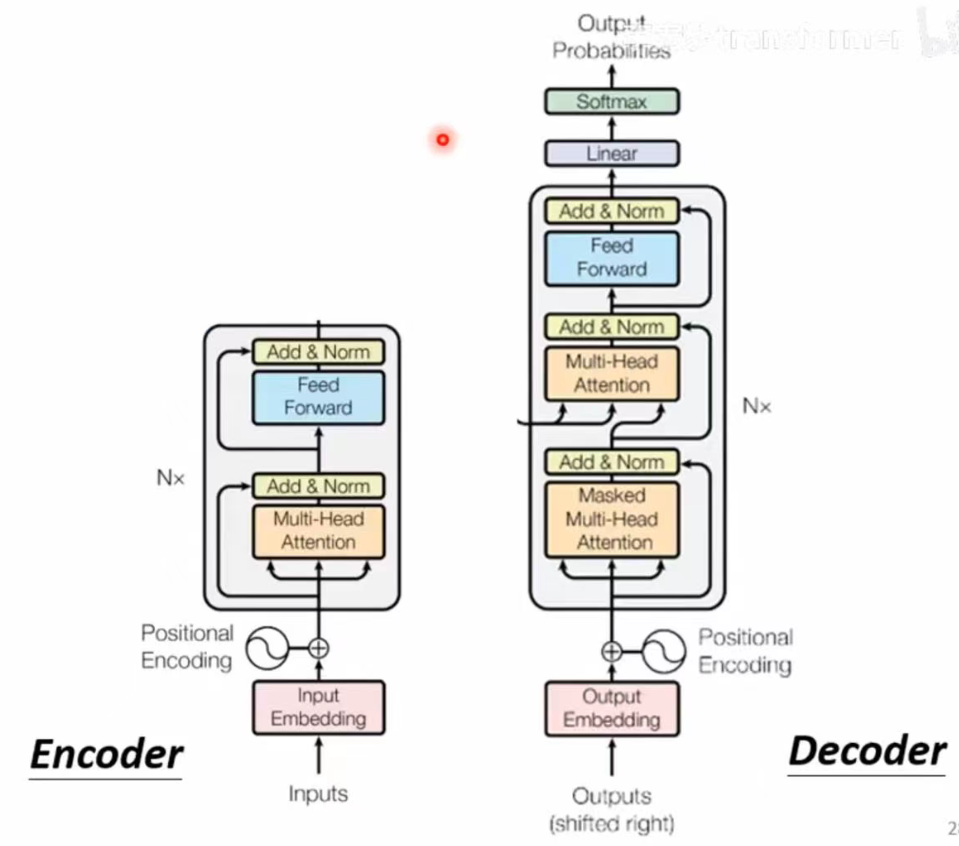

---

## 2. Encoder (编码器)
Encoder由N个相同的**Block（层）**堆叠而成。每个Block内部主要由两个子层构成：
1.  **多头自注意力层 (Multi-Head Self-Attention):** 这是Transformer的核心。它让输入序列中的每个单词都能“看到”序列中的所有其他单词，并计算出每个单词对于当前单词的重要性（权重），从而捕捉句子内部的依赖关系（如主谓宾结构）。
2.  **全连接前馈网络 (Position-wise Feed-Forward Network, FFN):** 一个简单的两层全连接网络，对自注意力层的输出进行一次非线性变换，增强模型的表达能力。

每个子层都包裹在一个**残差连接 (Residual Connection)** 和**层归一化 (Layer Normalization)** 的结构中。即 `Output = LayerNorm(X + Sublayer(X))`。

*   **详细结构图解:**
    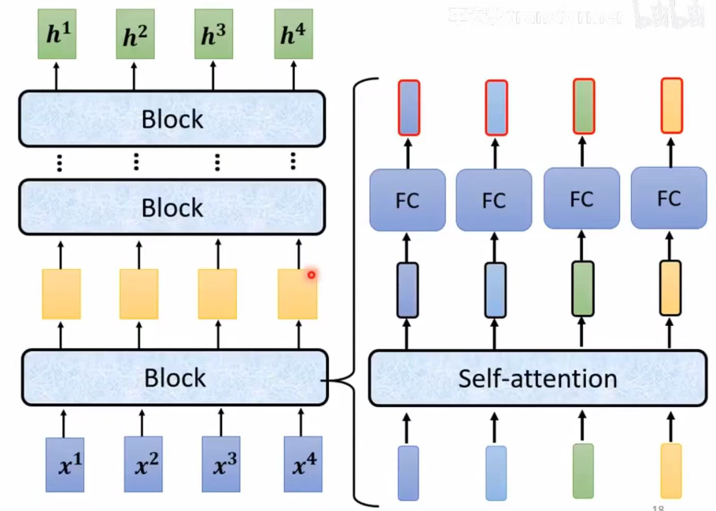
*   **论文中的架构图:**
    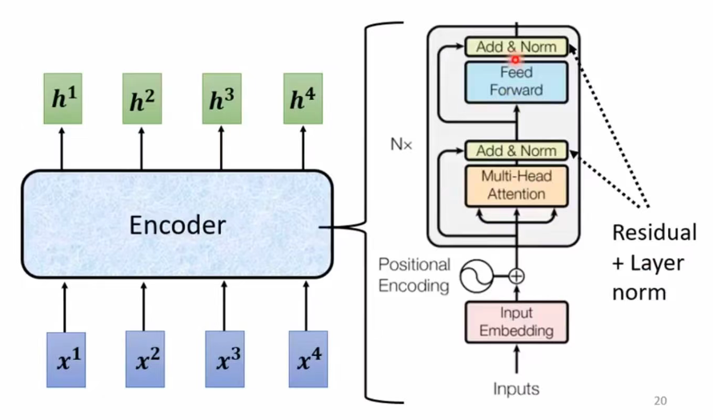
    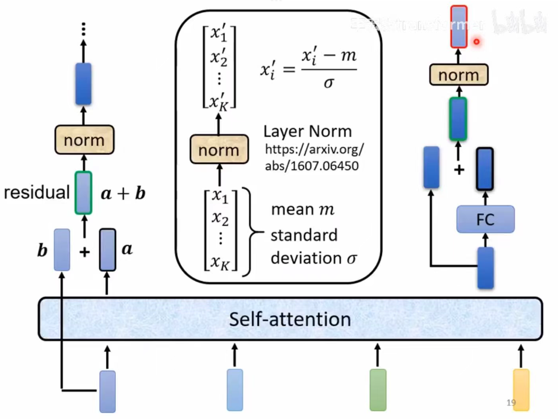

---

## 3. Decoder (解码器)

### a. 自回归 (Autoregressive, AT)
AT模式是“一次生成一个”的串行模式，就像人类说话一样。
以语音识别（Speech Recognition）为例：
1.  在解码开始时，输入一个特殊的开始符 **`<BOS>` (Begin of Sentence)** 给Decoder。Decoder根据Encoder传来的语音信息和这个开始符，计算出一个词汇表的概率分布，并输出概率最高的那个字（例如，“机”）。
2.  在下一步，将 **`<BOS>` 和上一步的输出“机”** 一同作为输入，送入Decoder。Decoder再次计算概率分布，输出下一个最可能的字（例如，“器”）。
3.  这个过程循环往复，直到Decoder输出一个特殊的结束符 **`<EOS>` (End of Sentence)** 为止。

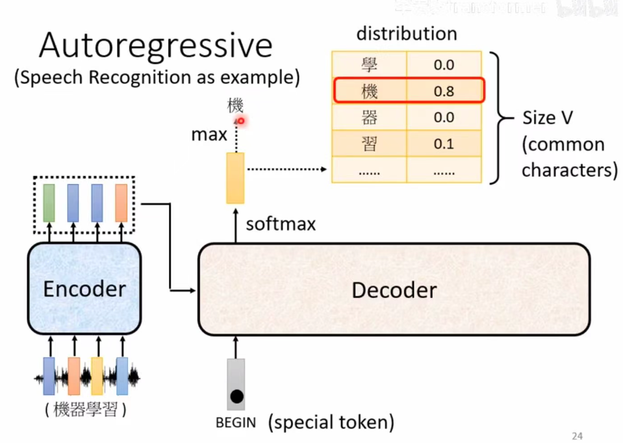
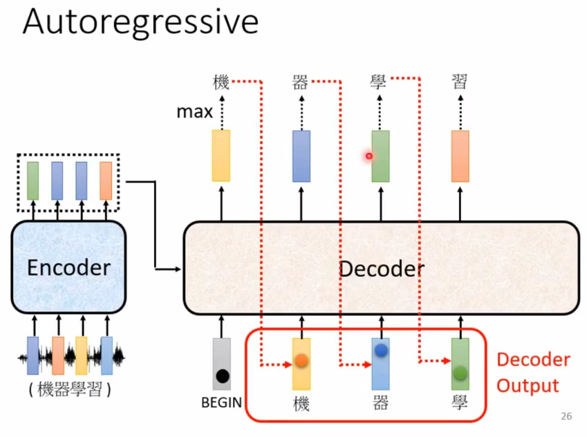

#### Encoder vs. Decoder 的关键区别：Masked Self-Attention
*   在Decoder中，Self-Attention层是**带掩码的 (Masked Self-Attention)**。
*   **目的:** 防止在预测位置 `i` 的单词时，模型“偷看”到位置 `i` 之后（未来）的单词。在生成“器”的时候，模型只能看到“机”，不能看到后面正确的答案“学”、“习”。
*   **实现:** 通过一个上三角矩阵的掩码（Mask）来实现，将未来的信息遮盖掉。
*   **例子:**
    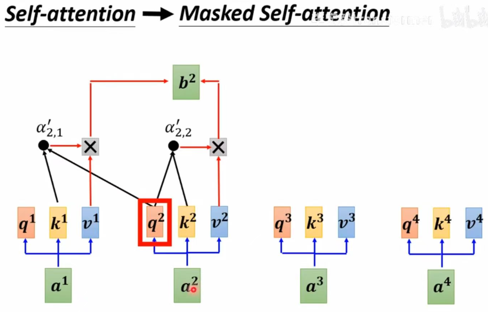

#### 问题：如何确定输出序列的长度？
*   **解决:** 引入一个特殊的结束符 `<END>` 或 `<EOS>`。模型被训练来在序列生成完毕后输出这个符号，一旦生成了`<END>`，解码过程就停止。

### b. 非自回归 (Non-Autoregressive, NAT)
NAT模式试图一次性并行生成整个输出序列，而不是一个一个地生成。

*   **AT vs. NAT 对比图:**
    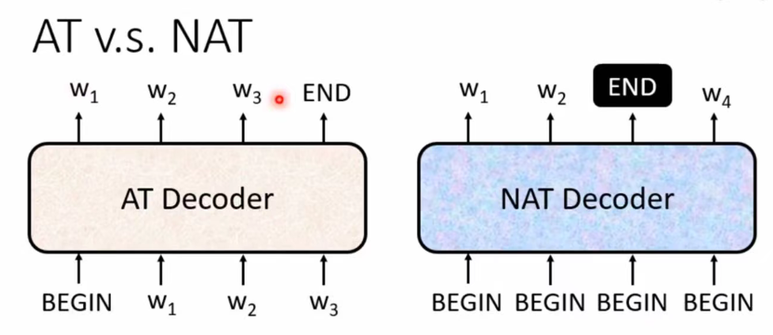

#### ▶ 如何决定 NAT 解码器的输出长度？
NAT模型必须先预测出目标序列的长度，才能并行生成。
*   **方法1:** 训练另一个**长度预测器 (Length Predictor)**，先预测出输出应该有多长。
*   **方法2:** 让模型先生成一个非常长的序列，然后简单地忽略`<END>`符号之后的所有内容。

#### ▶ 优缺点
*   **优点:**
    *   **并行生成:** 速度极快，解码延迟低。
    *   **可控输出长度:** 可以显式地控制生成序列的长度。
*   **缺点:**
    *   **条件独立性:** 因为是并行生成，每个位置的输出都是相互独立的，无法像AT模型那样利用已生成词的信息，这通常导致生成质量下降（所谓的“多模态问题”，即同一个意思可以有多种表达方式，NAT难以抉择）。

---

## 4. Encoder-Decoder的连接方式：Cross-Attention
**Cross-Attention (交叉注意力)** 是连接Encoder和Decoder的桥梁，它让Decoder在生成每个单词时，能够“聚焦”到输入序列中最相关的部分。

*   **输入来源:**
    *   **Query (Q):** 来自Decoder的**下层**（Masked Self-Attention的输出）。这个Q代表了“我现在要生成什么”。
    *   **Key (K) 和 Value (V):** 均来自**Encoder的最终输出**。这代表了“输入序列的所有信息都在这里，供你参考”。
*   **过程:** Decoder的Query会和Encoder输出的所有Key进行匹配计算，得到注意力权重，然后用这个权重去加权求和Encoder的Value，得到一个为当前生成步骤量身定制的上下文向量。
    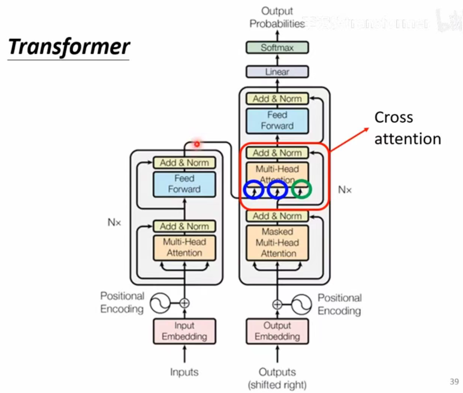
*   **步骤图解:**
    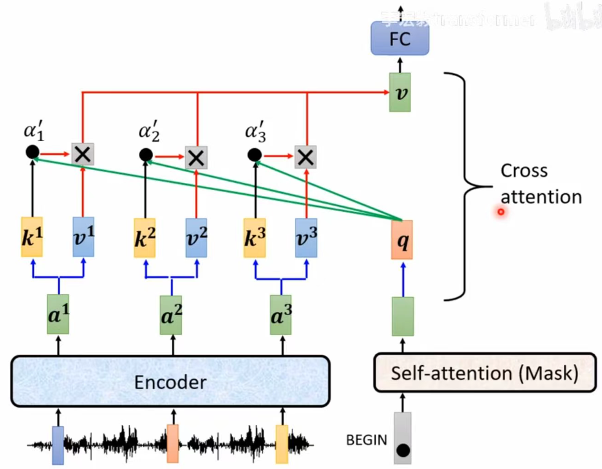

---

## 5. 训练 (Training)

### a. 优化指标：最小化交叉熵 (Cross Entropy)
*   模型训练的目标是让模型在每一步预测的概率分布，都尽可能地接近**真实标签 (Ground Truth)** 的概率分布（即one-hot向量）。
*   这通过最小化**交叉熵损失**来实现。
    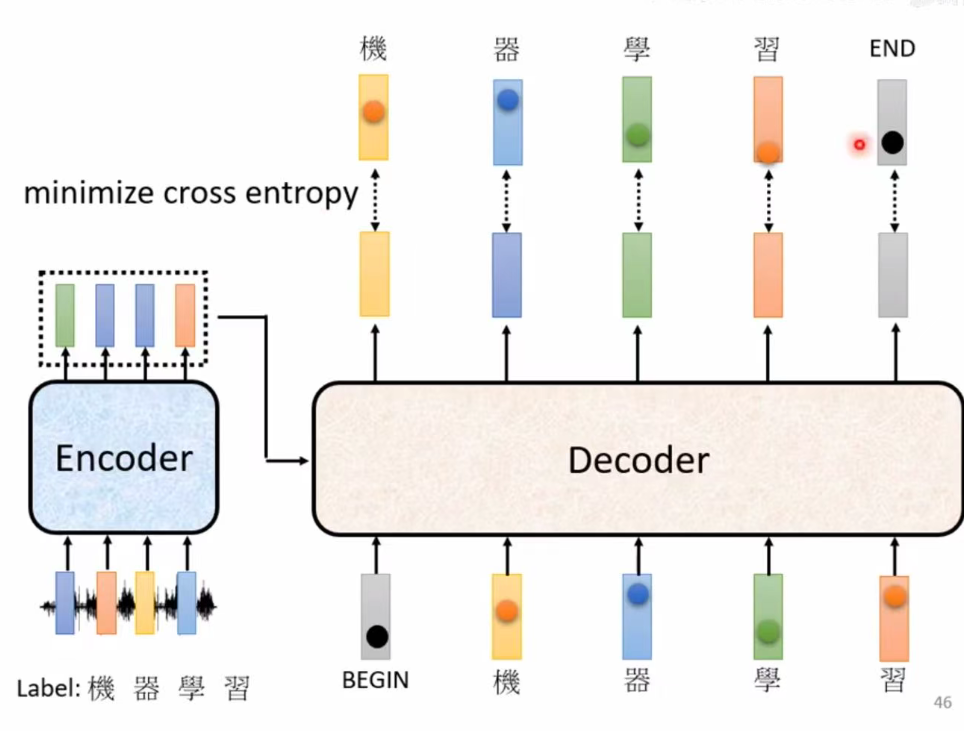

### b. Teacher Forcing
*   在训练AT模型时，为了提高训练效率和稳定性，通常采用**Teacher Forcing**策略。
*   **含义:** 无论模型在上一步预测出什么单词（即使是错误的），在当前步骤的输入中，我们总是强制喂给它**正确的答案（Ground Truth）**。
*   **优点:** 避免了误差累积，让模型可以在每一步都学习到正确的映射关系。
*   **缺点:** 导致了训练（Training）和推理（Inference）之间的不匹配，即**Exposure Bias**。
    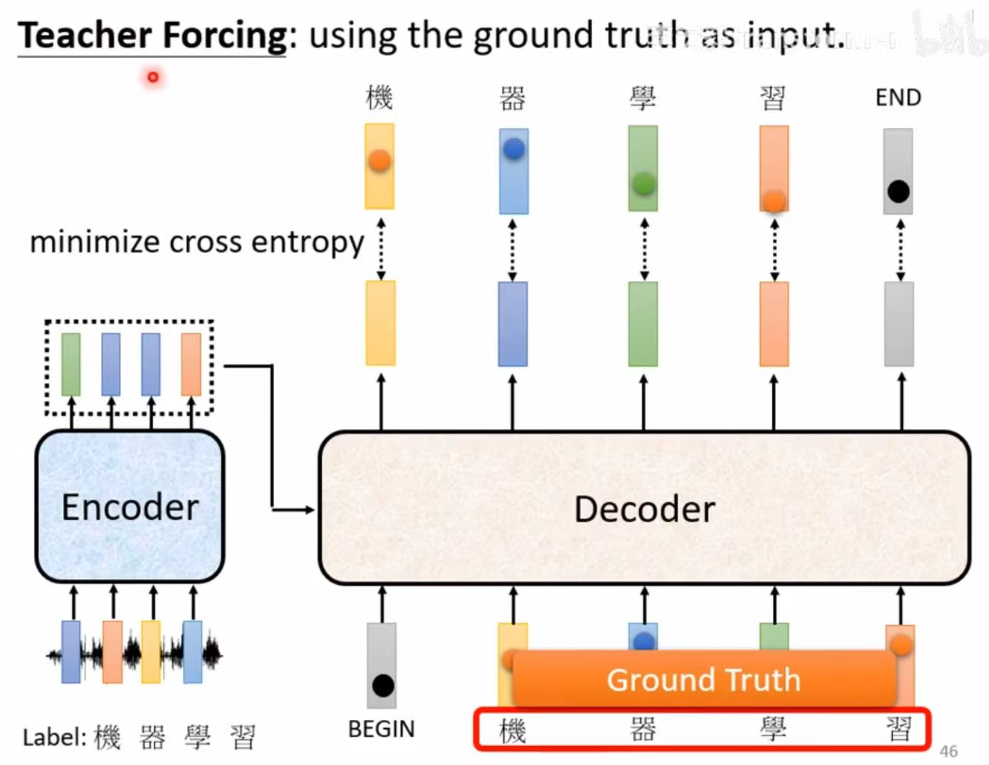

---

## 6. 技巧与优化 (Tips & Tricks)

### a. 复制机制 (Copy Mechanism)
*   在某些任务中（如对话机器人、文本摘要），输出序列中有一部分词是直接从输入序列中“复制”过来的（如人名、地名、代码）。
*   复制机制允许模型在生成时，既可以从词汇表中选择一个词，也可以选择直接从输入中复制一个词作为输出。
    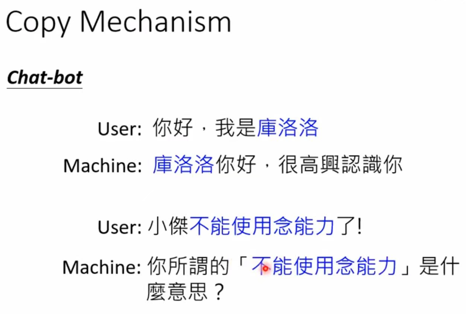

### b. 引导注意力 (Guided Attention)
*   在某些任务中（如语音识别、机器翻译），输入和输出的对齐关系通常是**单调的**（从左到右）。
*   引导注意力通过增加一个额外的损失项，来“鼓励”模型的注意力权重矩阵也呈现出大致单调对齐的模式，从而帮助模型学习到更好的对齐关系。
*   **例如:** Monotonic Attention, Location-aware Attention。
    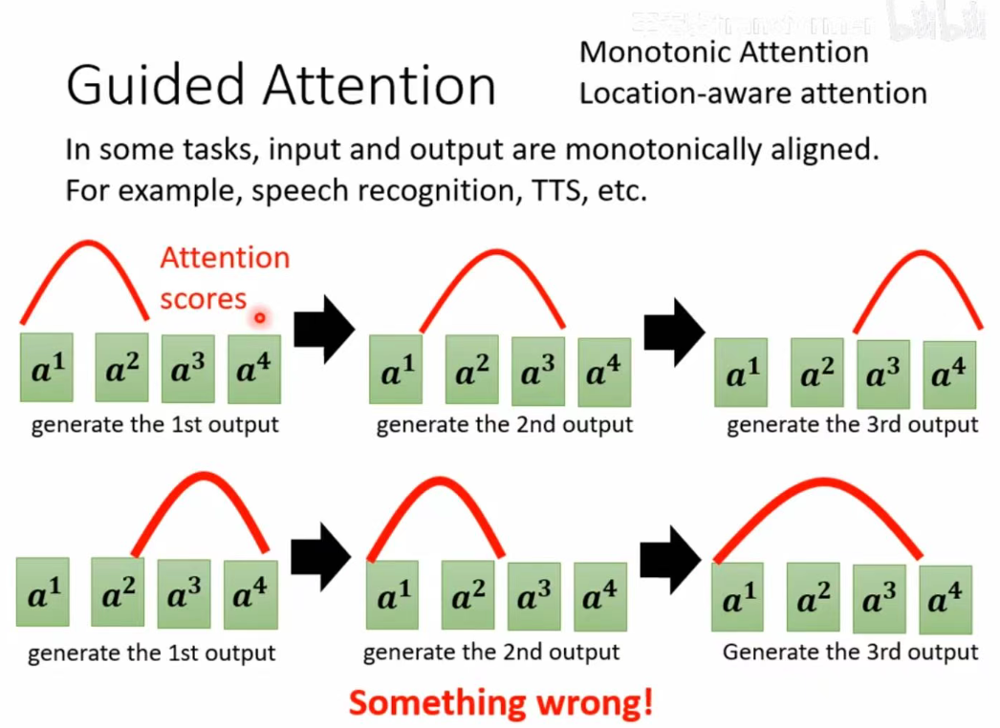

### c. 集束搜索 (Beam Search)
*   **Greedy Search (贪心搜索):** 在解码的每一步都选择概率最高的那个词。这是一种短视行为，不一定能得到全局最优的序列。
*   **Beam Search:** 在每一步都保留 `k` 个（`k`是beam size）最有可能的候选序列。在下一步，基于这 `k` 个序列继续扩展，并再次选出总概率最高的 `k` 个新序列。这是一种在计算成本和搜索质量之间的权衡。
    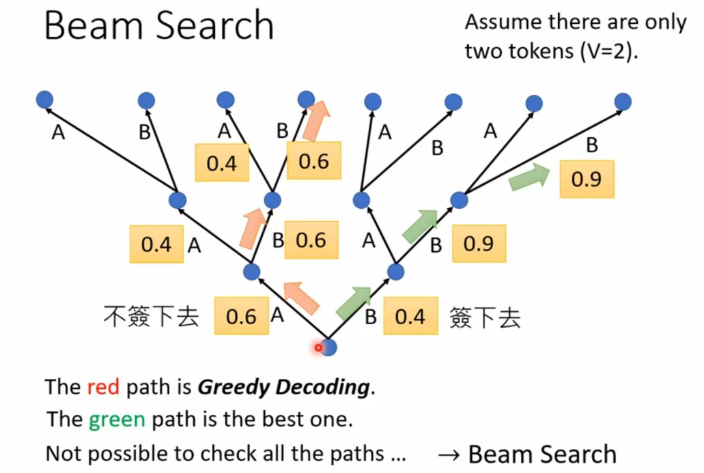

### d. 优化评估指标 (Optimizing Evaluation Metrics)
*   训练时的Cross-Entropy损失与最终的评估指标（如BLEU、ROUGE）并不完全一致。
*   **解决方案:** 在模型预训练好之后，可以使用**强化学习 (Reinforcement Learning, RL)** 来直接优化这些评估指标。将评估指标的分数作为RL中的**奖励 (Reward)**，来微调模型。
    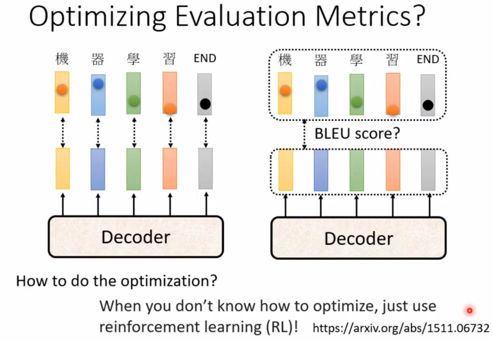

### e. 曝光偏差 (Exposure Bias) 与计划采样 (Scheduled Sampling)
*   **问题 (Exposure Bias):** 训练时使用Teacher Forcing，模型从未“见过”自己的错误；而测试时，模型必须依赖自己（可能错误）的输出来进行下一步预测。这种差异导致模型在面对错误时很脆弱。
*   **解决方案 (Scheduled Sampling):** 在训练过程中，以一定的概率，选择将模型**自己的上一部输出**（而不是Ground Truth）作为当前步的输入。这个概率可以随着训练的进行而逐渐增加。这相当于让模型在训练中提前“适应”测试时的环境。
    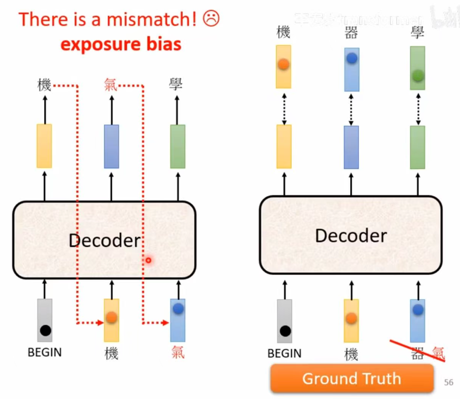
