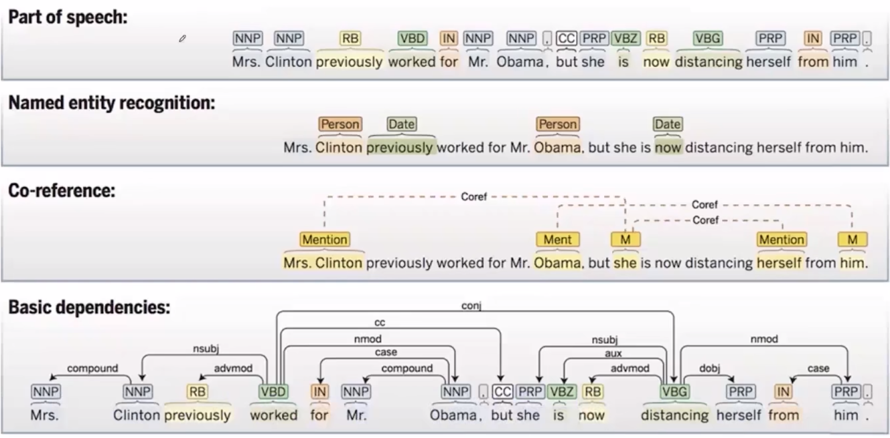
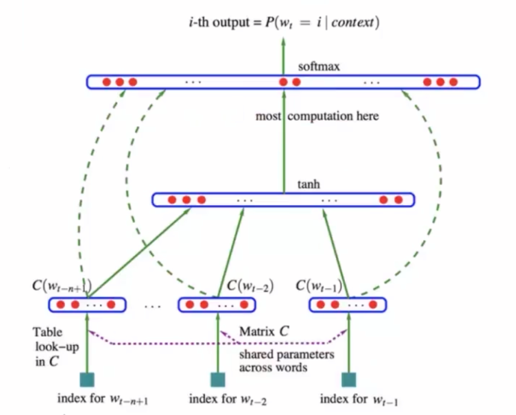
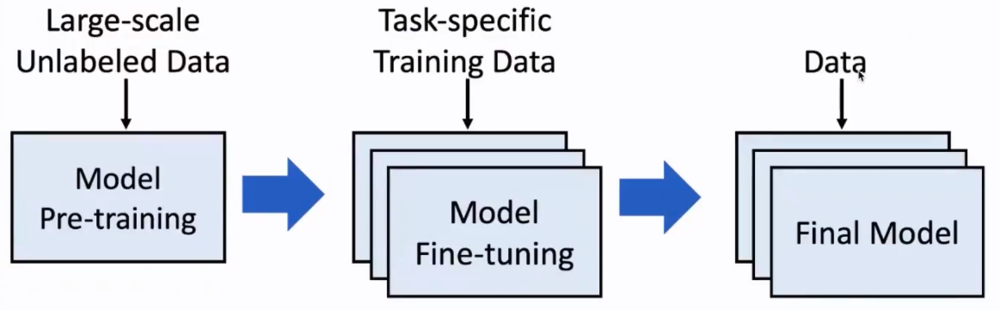

# L1：自然语言处理基础

## 1. 基本任务（Core NLP Tasks）

### 1.1 词性标注（Part-of-Speech Tagging, POS）
- 识别词在句中的语法角色，如名词、动词、形容词等。
- 常用模型：隐马尔可夫模型（HMM）、条件随机场（CRF）、神经网络（BiLSTM + CRF）。

### 1.2 命名实体识别（Named Entity Recognition, NER）
- 识别人名、地名、机构名、时间等实体类别。
- 典型应用：信息抽取、知识图谱构建、问答系统。
- 常见方法：统计模型（CRF）、深度学习（BiLSTM-CRF）、预训练模型（BERT）。

### 1.3 共指消解（Co-reference Resolution）
- 判断文本中多次提及是否指向同一实体，如“李雷……他……该学生”。
- 难点：语义理解、篇章结构、指代链建模。

### 1.4 句法分析：依存句法（Dependency Parsing）
- 识别词与词之间的依存关系，如主谓、动宾、修饰关系。
- 输出是一个树结构（依存树）。
- 应用：信息抽取、关系提取、机器翻译等。

---

## 2. NLP 应用场景

### 2.1 在线搜索引擎（Text Matching）
- 通过 Query 与 Document 的相似度计算进行排序。
- 常用模型：BM25、TF-IDF、DSSM、BERT-based 模型。

### 2.2 知识图谱构建（Knowledge Graph Construction）
- 自动从文本中抽取三元组（实体 – 关系 – 实体）。
- 步骤包括：实体识别、关系抽取、实体对齐、图谱融合。

### 2.3 机器翻译（Machine Translation）
- 早期方法：统计机器翻译（SMT）。
- 当前主流：基于 Transformer 的神经机器翻译（NMT）。

### 2.4 情感分析（Sentiment Analysis）
- 识别文本的情绪倾向，如正面/负面/中性。
- 典型应用：舆情分析、产品评价、客服辅助。

### 2.5 计算社会科学（Computational Social Science）
- 借助 NLP 对社交媒体、新闻、政策文本等进行大规模分析。
- 应用如政治倾向测量、公共议题分析、社会网络研究。

---

## 3. 词表示（Word Representation）

### 3.1 目标
- 度量词语相似度。
- 推断语义关系与类比关系（king − man + woman = queen）。

### 3.2 词表示方法演进

#### (1) 基于词典：Synonyms / Hypernyms
- 依赖人工词典（如 WordNet）。
- 局限：
  - 难覆盖新词义。
  - 主观性强。
  - 无法计算连续语义空间中的距离。

#### (2) One-hot Representation
- 高维稀疏向量。
- 缺点：
  - 任意两词正交，不体现任何语义相似度。

#### (3) 基于上下文统计（Co-occurrence Counts）
- 使用共现矩阵（如 PMI）表示词语。
- 缺点：
  - 维度极高。
  - 稀疏性强。
  - 难以处理低频词。

#### (4) 分布式词向量（Word Embedding）
- 代表方法：Word2Vec（Skip-gram、CBOW）、GloVe。
- 特点：
  - 低维、稠密、分布式。
  - 能捕捉语义与语法关系。
  - 向量空间结构具有线性可解释性。

---

## 4. 语言模型（Language Model）

### 4.1 定义
对序列的联合概率进行建模，用于预测下一个词。
  $$
  P(w_1, w_2, \dots, w_n) = \prod_{i=1}^{n} P(w_i \mid w_1, w_2, \dots, w_{i-1})
  $$

### 4.2 主要功能
1. 计算句子的整体概率（语言流畅度评估）。
2. 根据上下文预测下一个词（文本生成核心）。

### 4.3 假设
- 未来词只依赖前文（因果结构）。

### 4.4 构建方法

#### (1) N-gram 模型
- 基于马尔可夫假设：只依赖前 N-1 个词。
     $$
     \text{E.g., 4-gram} \quad
     P(w_j \mid \text{never too late to}) = \frac{\text{count}(\text{too late to } w_j)}{\text{count}(\text{too late to})}
     $$
- 优点：简单、高效、易实现。
- 缺点：
  - 无法处理长距离依赖。
  - 参数随词表规模爆炸。
  - 无法引入词向量语义知识。

#### (2) 神经语言模型（Neural LM）
- 用神经网络建模条件概率。
- 典型结构：MLP、RNN、LSTM、GRU、Transformer。
- 优点：
  - 更强的表示能力。
  - 能捕捉较长上下文。
- 缺点：训练成本高。
> 

---

## 5. 大模型基础（Pretrained Large Models）

### 5.1 为什么预训练重要
1. 大规模语料训练可学习语言模式、世界知识、常识推理能力。
2. 降低下游任务的数据需求，提高泛化性。

### 5.2 预训练范式（Pretrain → Finetune → Deploy）
- **预训练**：通过无监督或自监督任务（MLM、CLM）学习语言结构。
- **微调（Finetune）**：在任务数据上定向训练。
- **部署（Inference）**：用于实际应用，如问答、翻译、写作助手。
> 

### 5.3 Transformer 的关键优势
- 自注意力机制能够捕捉长距离依赖。
- 并行化程度高，训练效率高。
- 是现代大模型（GPT、BERT、T5）的核心架构。
