# L2神经网络基础

### 1. 神经网络组成 (Neural Network)

#### 基本单元：神经元
神经网络的基本构建模块是神经元。每个神经元接收一组输入，通过一个加权和（加上偏置项）进行线性变换，然后通过一个非线性的激活函数 $f$ 得到输出。

- **单个神经元公式**：
$$ h_{w,b}(x) = f(w^Tx + b)$$

  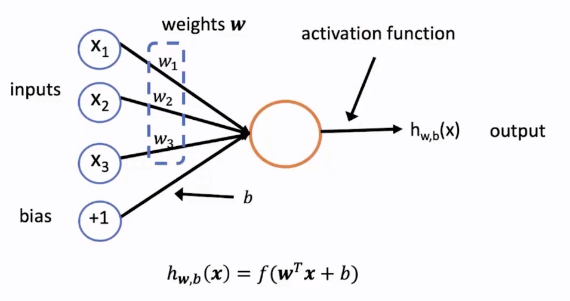

#### 网络结构：多层感知机 (MLP)
通过将神经元组织成层，并堆叠这些层，我们构建了多层神经网络（或多层感知机）。

- **典型结构**:
    - **输入层 (Input Layer)**: 接收原始数据，例如词向量。
    - **隐藏层 (Hidden Layer)**: 位于输入层和输出层之间，可以有一层或多层。负责提取和转换特征。
    - **输出层 (Output Layer)**: 生成最终的预测结果。

- **矩阵表示**:
对于一个隐藏层，其所有神经元的计算可以高效地通过矩阵运算表示：
$$ \mathbf{a} = f(\mathbf{W}\mathbf{x} + \mathbf{b}) $$
其中，`x` 是输入向量，`W` 是权重矩阵，`b` 是偏置向量，`a` 是该层的输出（激活值）向量。

  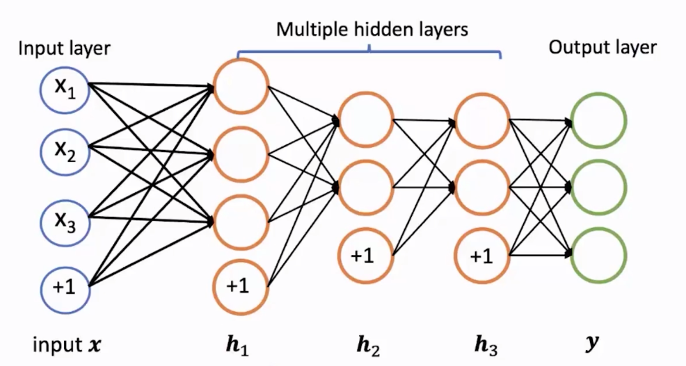

#### 激活函数 (Activation Functions)
激活函数为神经网络引入非线性，这是至关重要的。

- **为什么需要非线性?**
    - 如果没有非线性激活函数，多层神经网络本质上等同于一个单层线性网络（因为多个线性变换的组合仍然是线性的），这将极大地限制模型的表达能力。
    - 非线性使得神经网络能够学习和拟合更加复杂的函数关系。

- **常见激活函数**:

| 函数 | 公式 | 图像 | 优点/缺点 |
| :--- | :--- | :--- | :--- |
| **Sigmoid** | $\sigma(x)=\frac{1}{1+e^{-x}}$ | 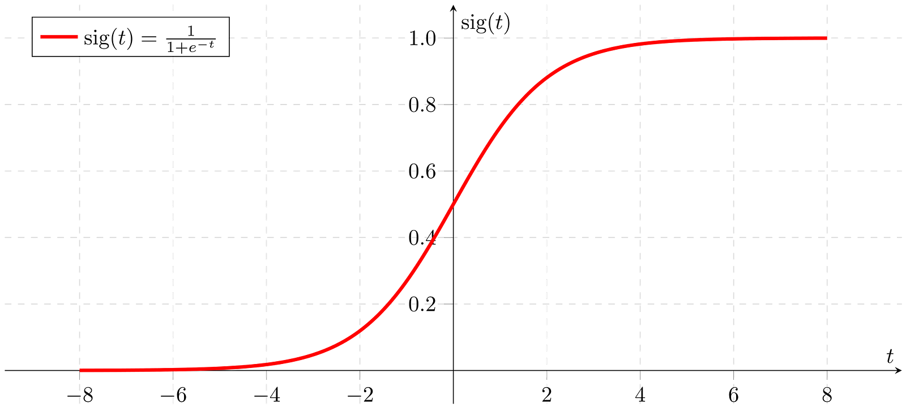 | **优点**: 输出在 (0, 1) 之间，可用作概率。 **缺点**: 容易导致梯度消失；输出非零中心。 |
| **Tanh** | $\tanh(x)=\frac{e^{x}-e^{-x}}{e^{x}+e^{-x}}$ | 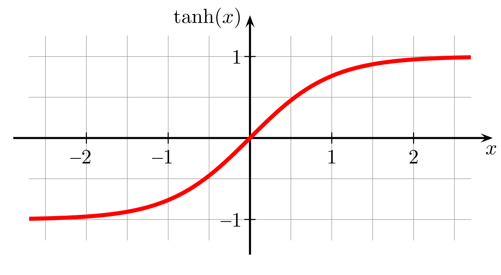 | **优点**: 输出是零中心的 (-1, 1)。 **缺点**: 仍然存在梯度消失问题。 |
| **ReLU** | $\mathrm{ReLU}(x)=\max(0,x)$ |  | **优点**: 计算高效；在正区间不会梯度消失。**缺点**: 输出非零中心；可能导致神经元“死亡”。|

#### 输出层 (Output Layer)
输出层的设计取决于具体的任务。

- **回归任务 (Regression)**: 通常使用 **线性输出**，直接预测一个连续值。
  $$ y = w^Th + b $$
- **二分类任务 (Binary Classification)**: 使用 **Sigmoid** 函数，将输出转换为 (0, 1) 之间的概率值。
  $$ y = \sigma (w^Th + b) $$
- **多分类任务 (Multi-class Classification)**: 使用 **Softmax** 函数，将输出向量转换为一个概率分布，所有类别的概率之和为1。
  $$y_i = \mathrm{softmax}(\mathbf{z})_i = \frac{e^{z_i}}{\sum_{j=1}^{K} e^{z_j}}$$

### 2. 如何训练神经网络

#### a. 训练目标：损失函数 (Loss Function)
损失函数用于衡量模型预测值与真实值之间的差距。训练的目标就是最小化这个损失。

- **均方误差 (Mean Squared Error, MSE)**: 常用于回归任务。
  $$ J = \frac{1}{N} \sum_{i=1}^{N} (y_i - \hat{y}_i)^2 $$
- **交叉熵 (Cross-Entropy)**: 常用于分类任务。它衡量两个概率分布的差异。
  $$ J = - \sum_{i=1}^{C} y_i \log(\hat{y}_i) $$
  其中 `y` 是表示真实类别的 one-hot 向量，`ŷ` 是模型预测的概率分布。

#### b. 优化方法：最小化损失

- **梯度下降 (Gradient Descent)**:
  一种迭代优化算法，通过计算损失函数关于模型参数 `θ` 的梯度 `∇J(θ)`，并沿着梯度的反方向更新参数，从而逐步找到损失的最小值。
  - **更新规则**:
    $$ \theta^{\text{new}} = \theta^{\text{old}} - \alpha \nabla_{\theta} J(\theta) $$
    其中，`α` 是学习率 (learning rate)，控制每次更新的步长。实践中常用的是随机梯度下降 (SGD) 及其变体 (Adam, Adagrad 等)，它们使用小批量数据来计算梯度，以提高训练效率。

- **反向传播算法 (Backpropagation)**:
  这是在神经网络中高效计算梯度的核心算法。它利用链式法则，从输出层开始，逐层向后计算梯度。
  - **核心思想**: 每一层的梯度（downstream gradient）可以由后一层的梯度（upstream gradient）乘以该层的局部梯度（local gradient）得到。
  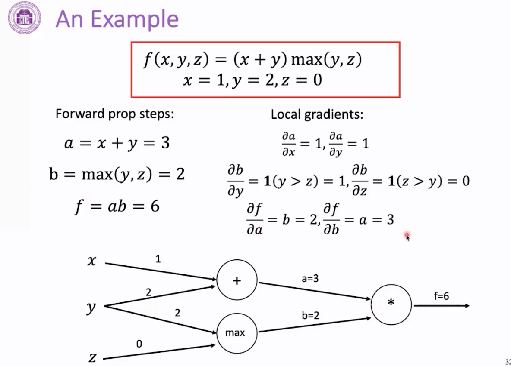

### 3. 词汇表示：Word2vec

Word2vec 是一套用于学习词嵌入（Word Embedding）的模型，它基于“一个词的含义由其上下文决定”的思想。

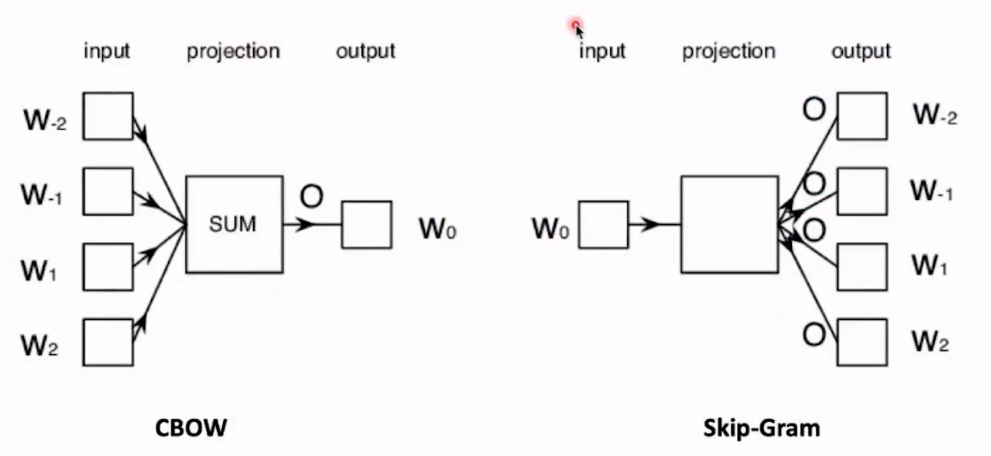

#### Continuous Bag-Of-Words (CBOW)
- **介绍**: CBOW 模型通过上下文词（Context Words）来预测中心的目标词（Target Word）。它将上下文词的向量取平均（因此称为“词袋”），然后用这个平均向量来预测目标词。
- **优点**: 训练速度比 Skip-gram 快，对于高频词的表示效果更好。
- **例子**:
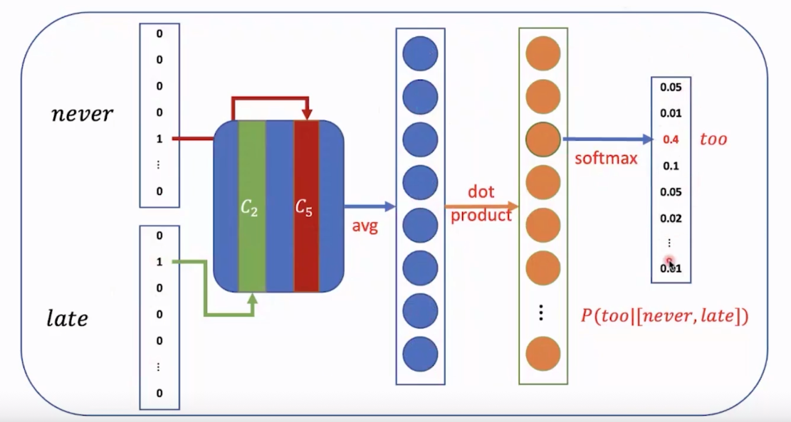

#### Continuous Skip-Gram
- **介绍**: Skip-gram 模型的逻辑与 CBOW 相反，它使用中心的目标词来预测其周围的上下文词。
- **优点**: 在处理小规模数据集时效果好，并且能更好地表示罕见词或短语。
- **例子**:
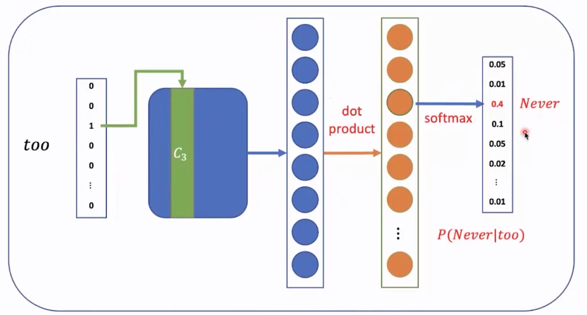

#### 提高计算效率
由于 Softmax 在面对巨大词汇表时计算成本高昂，Word2vec 引入了两种优化技巧：

- **负采样 (Negative Sampling)**: 在更新权重时，不计算整个词汇表的 Softmax，而是将问题转化为一个二分类问题：判断一个词对（目标词，上下文词）是正样本（真实出现在上下文中）还是负样本（随机采样的词）。每次只更新正样本和少数几个负样本的权重，大大降低了计算量。
- **分层 Softmax (Hierarchical Softmax)**: 使用一个二叉树（通常是哈夫曼树）来表示词汇表。每个叶子节点代表一个词。预测一个词的概率就变成了从根节点到对应叶子节点的一系列路径选择的概率乘积。这同样避免了对整个词汇表进行归一化。

#### 其他训练技巧
- **高频词降采样 (Sub-sampling)**: 像 "the", "a", "is" 这样的高频词提供的语义信息有限。该技巧以一定概率丢弃这些高频词，以加快训练速度并提高罕见词的向量质量。
- **软滑动窗口 (Soft Sliding Window)**: 与使用固定大小的窗口不同，窗口大小在一个范围内随机变化。这使得模型在学习时，给予离中心词更近的词更高的权重。

### 4. 循环神经网络 (RNN)

RNN 专为处理序列数据（如文本、时间序列）而设计。其核心特点是拥有“记忆”，能够将前一时刻的信息传递到当前时刻。

- **网络架构**: RNN 的神经元在计算当前时刻 `i` 的隐藏状态 `h_i` 时，不仅使用当前时刻的输入 `x_i`，还使用上一时刻的隐藏状态 `h_{i-1}`。
$$ h_i = \tanh(W_x x_i + W_h h_{i-1} + b) $$
$$ y_i = F(h_i) $$
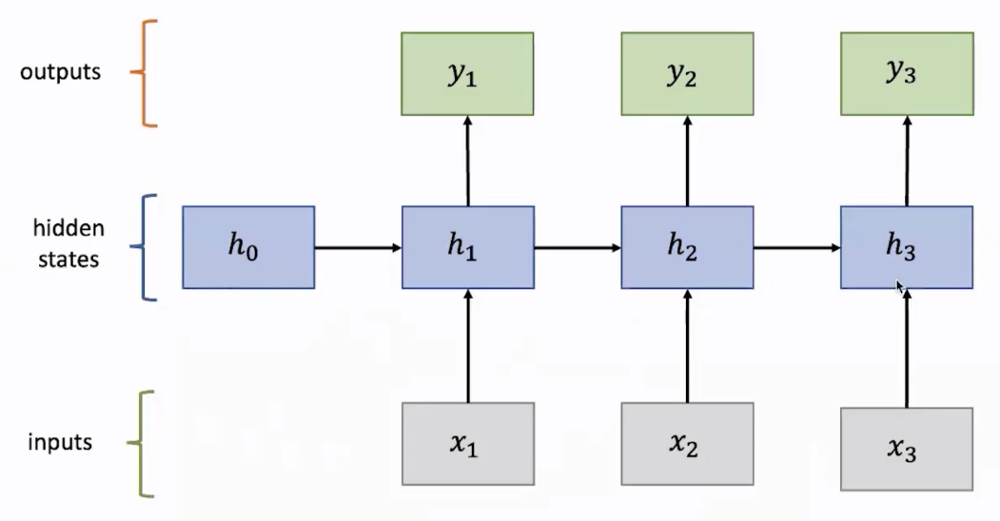

- **应用场景**: 语言模型、机器翻译、文本分类、命名实体识别等。
- **优点**:
  - **参数共享**: 同一个权重矩阵 `W` 在所有时间步重复使用，大大减少了模型参数量。
  - **处理可变长序列**: 理论上可以处理任意长度的序列。
- **缺点**:
  - **梯度消失/爆炸**: 由于信息在时间步上通过连乘传递，在长序列中，梯度可能变得极小（消失）或极大（爆炸），导致模型难以学习长距离依赖关系。
  - **计算并行性差**: 后续时间步的计算依赖于前序计算结果，难以并行化。

### 5. 门控循环单元 (GRU)

GRU 是 RNN 的一种变体，通过引入“门”机制来解决梯度消失问题，从而更好地捕捉长期依赖。

- **核心门控**:
    - **更新门 (Update Gate) `z_i`**: 决定在多大程度上将**过去的信息** (`h_{i-1}`) **直接复制**到当前状态。
        $$z_i = \sigma(W_x^{(z)} x_i + W_h^{(z)} h_{i-1} + b^{(z)})$$
    - **重置门 (Reset Gate) `r_i`**: 决定在计算**新的候选状态**时，**忽略**多少过去的信息。
        $$r_i = \sigma(W_x^{(r)} x_i + W_h^{(r)} h_{i-1} + b^{(r)})$$

- **工作流程**:
    1.  计算更新门 `z` 和重置门 `r`。
    2.  计算候选隐藏状态 `ĥ`，其中重置门 `r` 决定了 `h_{i-1}` 的影响力。
    3.  计算最终的隐藏状态 `h_i`。更新门 `z` 作为一个插值器，在旧状态 `h_{i-1}` 和新候选状态 `ĥ` 之间进行加权平均。

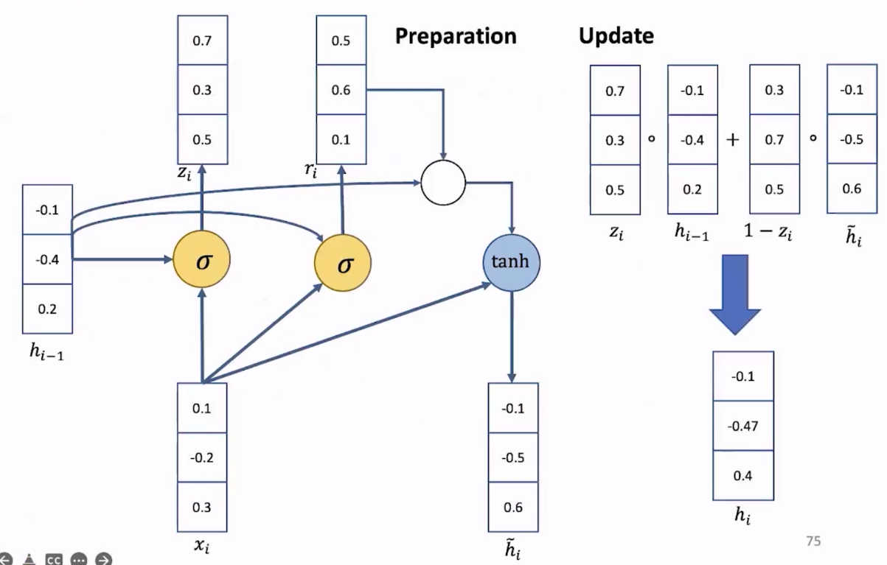

- **门的作用**:
  - 当 `r_i` 接近 0 时，模型会忽略过去的隐藏状态，基于当前输入 `x_i` 生成一个全新的候选状态。
  - 当 `z_i` 接近 1 时，模型会直接跳过当前计算，将上一时刻的隐藏状态 `h_{i-1}` 几乎原封不动地复制到 `h_i`，实现了“记忆跳过”。

### 6. 长短时记忆网络 (LSTM)

LSTM 是另一种更强大的 RNN 变体，它引入了一个独立的**细胞状态 (Cell State)** `C_t` 来存储长期记忆，并通过三个精密的“门”来控制信息的流动。

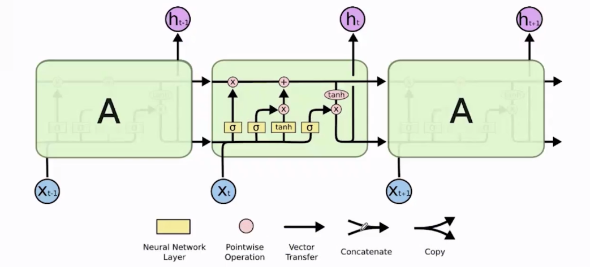

- **核心组件**:
    - **遗忘门 (Forget Gate) $f_t$**: 决定从旧的细胞状态 $C_{t-1}$ 中**遗忘**多少信息。
      $$f_t = \sigma(W_f \cdot [h_{t-1}, x_t] + b_f)$$
    - **输入门 (Input Gate) $i_t$**: 决定让多少**新的信息** $~C_t$ 被**写入**到细胞状态中。
      $$i_t = \sigma(W_i \cdot [h_{t-1}, x_t] + b_i)$$
    - **候选记忆 ($~C_t$)**: 基于当前输入和旧的隐藏状态，生成新的候选信息。
      $$\tilde{C}_t = \tanh(W_C \cdot [h_{t-1}, x_t] + b_C)$$
    - **输出门 (Output Gate) $o_t$**: 决定从更新后的细胞状态 $C_t$ 中**输出**多少信息到新的隐藏状态 $h_t$。
      $$o_t = \sigma(W_o \cdot [h_{t-1}, x_t] + b_o)$$

- **状态更新**:
    1. **细胞状态更新**: $C_t = f_t * C_{t-1} + i_t * ~C_t$ (忘记旧的 + 写入新的)
    2. **隐藏状态更新**: $h_t = o_t * tanh(C_t)$ (从细胞中提取信息作为输出)

### 7. 双向循环神经网络 (Bi-RNN)

标准 RNN 只能利用过去的信息。但在许多 NLP 任务中（如情感分析、实体识别），一个词的含义也依赖于其后的上下文。

- **结构**: Bi-RNN 由两个独立的 RNN 组成。一个按时间顺序（从左到右）处理序列，另一个按时间逆序（从右到左）处理。在任意时间步 $t$，最终的输出是两个 RNN 隐藏状态的拼接。
- **优势**: 使得模型在预测时能够同时利用过去和未来的上下文信息，从而做出更准确的判断。

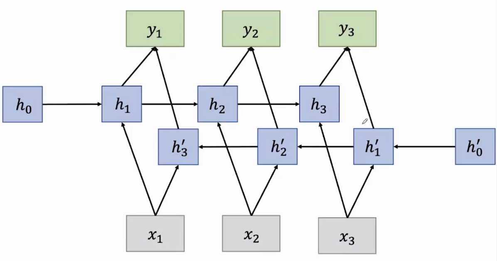

### 8. 卷积神经网络 (CNN)

CNN 最初为图像处理设计，但也被成功应用于 NLP 任务，尤其擅长提取文本中的局部特征。

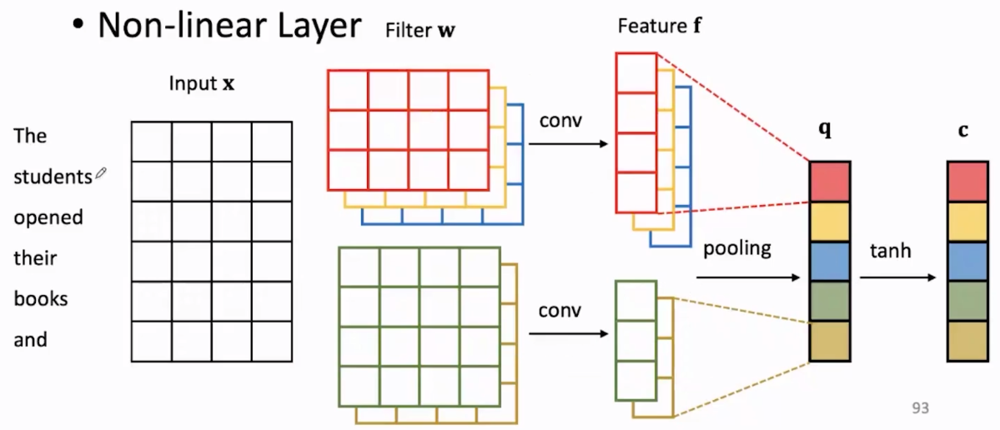

- **核心层级**:
    - **输入层 (Input Layer)**: 输入通常是一个句子矩阵，其中每一行是一个词的词向量。
    - **卷积层 (Convolutional Layer)**: 使用多个不同大小的**滤波器 (Filter)**（或称卷积核）在句子矩阵上滑动。每个滤波器可以看作一个 **n-gram 检测器**，用于捕捉特定的局部模式（如“非常 好”）。
    - **池化层 (Pooling Layer)**: 通常使用**最大池化 (Max-pooling)**，它对每个滤波器产生的特征图谱取最大值。这相当于从一个区域中提取出最强的信号，实现了特征降维和信息浓缩。
    - **全连接层 (Fully Connected Layer)**: 将池化后的特征拼接起来，送入一个或多个全连接层，最终通过 Softmax 等进行分类。

- **优势**:
    - **擅长提取局部特征**: n-gram 滤波器的设计使其非常适合捕捉短语级别的语义信息。
    - **可并行计算**: 卷积操作在不同位置上是独立的，非常适合 GPU 并行加速，计算效率高。
