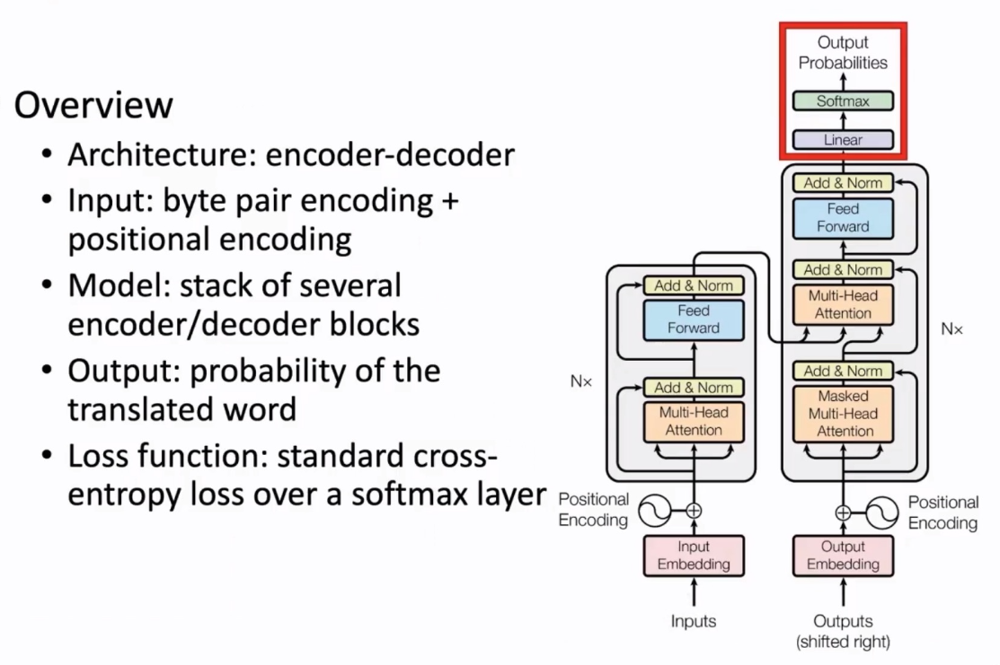
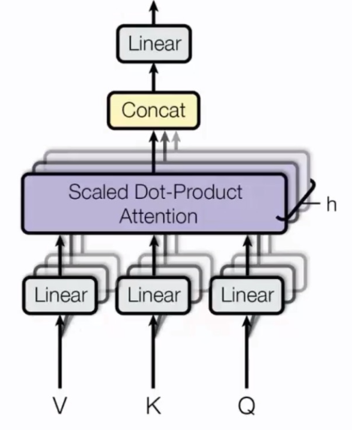
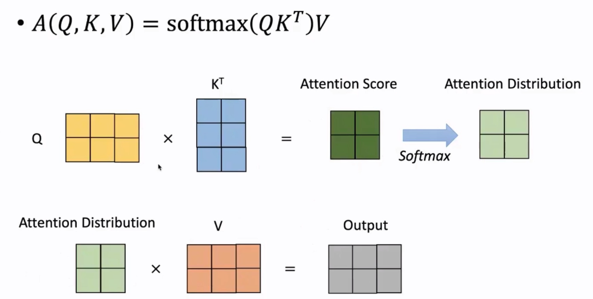
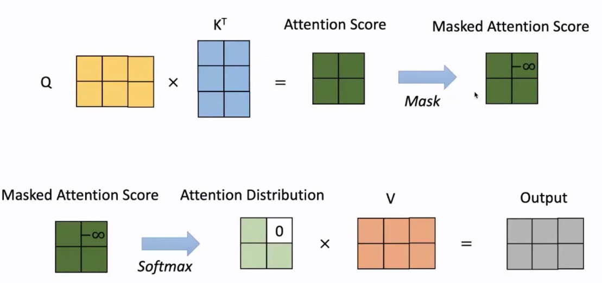

## L3自注意力机制和Transformer
### 1. Transformer 结构

#### a. 注意力机制 (Attention Mechanism)

**i. 引入背景：解决 Seq2Seq 模型的信息瓶颈问题**

传统的基于 RNN 的 Seq2Seq 模型（常用于机器翻译）包含一个编码器（Encoder）和一个解码器（Decoder）。

-   **编码器**：将整个输入句子（例如，一句德语）压缩成一个**固定大小**的上下文向量（Context Vector）。
-   **解码器**：基于这个上下文向量，逐词生成目标句子（例如，一句英语）。

**信息瓶颈 (Information Bottleneck) 问题**:
这个模型的缺陷在于，无论输入句子多长、多复杂，所有的信息都必须被硬塞进那个**唯一的、固定大小的**上下文向量中。这就好比让你只用一句话来总结一整本书的内容，必然会丢失大量细节。对于长句子，这个向量很难承载全部信息，导致翻译质量下降。

**解决方案**:
注意力机制允许解码器在生成每个词时，都**直接回顾**输入句子的所有部分，并**动态地决定**当前最应该“注意”哪个输入词。它会为每个输入词计算一个“重要性”分数，然后生成一个为当前步骤“量身定做”的上下文向量。这样就打破了单一固定向量的瓶颈。

**ii. 注意力计算步骤**

1.  **计算注意力分数**: 对于解码器的当前状态 `s` 和编码器的每个隐藏状态 `h`，计算一个分数 `score(s, h)`，这个分数衡量了输入词 `h` 对于生成当前输出词的重要性。
2.  **Softmax 归一化**: 将所有分数通过 Softmax 函数，转换成一个概率分布（即注意力权重），所有权重加起来等于 1。
3.  **加权求和**: 将这些权重与编码器的隐藏状态 `h` 进行加权求和，得到当前时间步的上下文向量 `c`。这个向量集中了当前最相关的输入信息。
4.  **生成输出**: 将上下文向量 `c` 与解码器当前状态 `s` 结合，用于预测下一个目标词。

#### b. 计算注意力分数的变体

注意力分数的计算方式有多种，核心是衡量 Query (查询) 和 Key (键) 之间的相似度。

| 名称 | 计算方式 | 描述 |
| :--- | :--- | :--- |
| **点积 (Dot-Product)** | `score(q, k) = q · k` | 计算简单高效，但要求 q 和 k 维度相同。 |
| **带权点积 (General)** | `score(q, k) = q^T W k` | 引入一个权重矩阵 `W`，增加了模型的表达能力。 |
| **加性注意力 (Additive)**| `score(q, k) = v^T tanh(W_1 q + W_2 k)` | 使用一个单层前馈网络，更灵活，但计算更复杂。|
| **缩放点积 (Scaled Dot-Product)**| `score(q, k) = (q · k) / sqrt(d_k)` | **Transformer 使用的方式**。通过缩放来防止点积结果过大，稳定梯度。|

#### c. Transformer 架构

**i. 概述**
Transformer 是第一个完全摒弃 RNN 和 CNN，仅依赖自注意力机制（Self-Attention）来处理序列数据的模型。它并行计算能力强，并且能更好地捕捉长距离依赖关系。

**ii. 输入层**
1.  **词元化 (Tokenization)**: 通常使用像 **BPE (Byte-Pair Encoding)** 这样的子词（Subword）切分方法。它能有效处理未登录词（OOV），并减小词表大小。
2.  **位置编码 (Positional Encoding)**: 由于自注意力机制本身不包含顺序信息（它平等地看待所有词），我们必须手动给模型注入位置信息。通过将一个与位置相关的向量加到词嵌入上，模型就能知道每个词在句子中的绝对或相对位置。

**iii. Encoder 端 Transformer Block**
每个 Encoder Block 由两个核心子层组成：

1.  **多头自注意力层 (Multi-Head Self-Attention)**:
    -   **自注意力 (Self-Attention)**: 句子中的每个词都会对自己所在句子中的所有词（包括自身）计算注意力。这使得每个词的表示都能包含整个句子的上下文信息。在自注意力中，Query, Key, Value 都来自同一个输入序列。
    -   **缩放点积注意力 (Scaled Dot-Product Attention)**:
        -   **公式**: $A(Q,K,V) = \text{softmax}\left(\frac{QK^T}{\sqrt{d_k}}\right)V$
        -   **为什么缩放?**: 当向量维度 `d_k` 很大时，点积 `QK^T` 的结果的方差也会很大，可能导致某些值极大或极小。这会将 Softmax 函数推向梯度非常小的区域，使得训练困难。除以 `sqrt(d_k)` 是一个有效的缩放技巧，能让训练过程更稳定。
        
    -   **多头 (Multi-Head)**: 与其只进行一次注意力计算，不如将 Query, Key, Value 通过不同的线性变换投影多次（比如8次，即8个“头”），然后并行地计算8次注意力。每个“头”可以学习到不同的语义子空间（比如有的头关注语法关系，有的头关注长距离依赖）。最后将8个头的结果拼接并再次进行线性变换，得到最终输出。

2.  **位置前馈网络 (Position-wise Feed-Forward Network)**:
    -   这是一个简单的两层全连接神经网络（MLP），它被**独立地**作用于序列中的**每个位置**（每个词的表示上）。
    -   $FFN(x) = \max(0, xW_1 + b_1)W_2 + b_2$

**Encoder Block 的两个关键技巧**:
1.  **残差连接 (Residual Connection)**: 在每个子层（自注意力层、前馈网络）的输入和输出之间，添加一个直接的连接（`x + Sublayer(x)`）。这极大地缓解了深度网络中的梯度消失问题，使得训练非常深的模型成为可能。
2.  **层归一化 (Layer Normalization)**: 在每个子层的输出后进行。它对单个样本的特征进行归一化（使其均值为0，方差为1），有助于稳定训练过程，加速收敛。

**iv. Decoder 端的 Transformer Block**

Decoder Block 比 Encoder 多一个子层，共三个：

1.  **带掩码的多头自注意力 (Masked Multi-Head Self-Attention)**: 这是 Decoder 内部的自注意力。在生成第 `i` 个词时，为了防止模型“作弊”看到未来的词，需要将第 `i` 个词之后的所有位置都**遮盖 (mask)**掉。
2.  **交叉注意力 (Cross-Attention)**: 这是连接 Encoder 和 Decoder 的桥梁。它的 **Query** 来自于 Decoder 的前一子层，而 **Key** 和 **Value** 则来自于 **Encoder 的最终输出**。这一步完全模拟了 Seq2Seq 中的注意力机制，让 Decoder 在生成每个词时都能“审视”整个输入序列。
3.  **位置前馈网络**: 与 Encoder 中的完全相同。

**v. 训练与解码技巧**
-   **Checkpoint Averaging**: 将训练最后几个保存点的模型参数进行平均，通常能获得一个更鲁棒的模型。
-   **ADAM Optimizer**: 一种自适应学习率的优化器，在 Transformer 训练中广泛使用。
-   **Dropout**: 在训练期间，以一定概率随机“丢弃”神经元，是一种有效的正则化手段，防止过拟合。
-   **Label Smoothing**: 一种正则化技术，它将 one-hot 的硬标签（如 [0, 0, 1, 0]）稍微“平滑”一下（如 [0.01, 0.01, 0.97, 0.01]），防止模型在预测时过于自信。
-   **Auto-regressive Decoding**: 解码时一个一个地生成词，每个新生成的词都会作为下一步的输入。
-   **Beam Search**: 一种比贪心搜索（每次都选概率最高的词）更优的解码策略。它在每一步都保留 `k` 个最可能的序列，从而有更大概率找到全局最优解。

### 2. 预训练语言模型的发展

#### 1. 语言模型 (Language Model)
-   **a. 任务**: 语言模型的核心任务是计算一个句子的概率。这通常通过“自回归”方式实现：给定前面的词，预测下一个最可能的词。
-   **b. 发展历程**:
    -   **Word2vec**: 学习静态的词向量，无法处理一词多义。
    -   **RNN/LSTM**: 能够处理序列信息，但受限于梯度消失和串行计算，难以捕捉长距离依赖。
    -   **GPT/BERT**: 基于 Transformer 架构，并行计算能力强，能够捕捉长距离依赖，成为现代 NLP 的基石。

#### 2. 预训练范式分类
-   **i. Feature-based (例如 ELMo)**: 将预训练模型作为特征提取器。模型的参数被**冻结**，其输出的词向量（通常是多层的加权平均）被用作下游任务模型的输入特征。
-   **ii. Fine-tuning (例如 GPT, BERT)**: 将预训练模型与一个简单的任务特定分类头相结合，然后在下游任务数据上对**整个模型**（或部分参数）进行微调。这是目前更主流、效果更好的范式。

#### 3. 代表性模型介绍 (Fine-tuning 范式)
**i. GPT (Generative Pre-trained Transformer)**
-   **架构**: 采用标准的 Transformer **Decoder** 结构。
-   **预训练任务**: **标准的从左到右语言模型 (Left-to-Right LM)**。即根据前面的所有词来预测下一个词。
-   **特点**: 这种单向的结构使其天然地非常适合文本**生成**任务。

**ii. BERT (Bidirectional Encoder Representations from Transformers)**
-   **架构**: 采用标准的 Transformer **Encoder** 结构。
-   **预训练任务**:
    1.  **掩码语言模型 (Masked LM, MLM)**: 随机将输入句子中 15% 的词替换为 `[MASK]` 标记，然后训练模型去**预测这些被遮盖的词**。因为模型可以同时看到左右两边的上下文，所以这是**真正的双向**表示。
    2.  **下一句预测 (Next Sentence Prediction, NSP)**: 给模型两个句子 A 和 B，让它判断 B 是不是 A 的下一句。旨在让模型学习句子间的关系。（后续研究发现此任务效果有限，已被 RoBERTa 等模型移除）。
-   **特点**: MLM 带来的深度双向上下文表示，使其在**理解**类任务（如分类、实体识别）上表现极其出色。

#### 4. 后续发展趋势
-   **i. T5 (Text-to-Text Transfer Transformer)**: 提出一个统一的“文本到文本”框架。它将所有 NLP 任务都转换成生成任务。例如，情感分类任务的输入是 `"sentiment: This movie is great!"`，模型被训练去生成 `"positive"`。
-   **ii. MoE (Mixture of Experts)**: 一种扩展模型规模的有效方法。它将模型中的部分前馈网络层替换为多个“专家”网络，并用一个小的“门控网络”来决定每次为输入 token 激活哪个（或哪几个）专家。这使得模型总参数量可以非常大，但每次推理的计算量保持不变，实现了“稀疏激活”。