## L4：大模型学习方法
### 1. 预训练 (Pre-training)

#### a. 引入：从上下文表示到 Transformer 架构

-   **ELMo (Embeddings from Language Models)**: 是一个重要的里程碑，它开启了**上下文词向量**的时代。ELMo 通过双向 LSTM 预训练，使得同一个词在不同上下文中能有不同的向量表示。其特点是 **Deep** (多层表示) 和 **Contextual** (上下文相关)。

-   **Transformer**: 彻底取代了 RNN，成为现代预训练模型的基础。根据其结构，主流模型可以分为三类：

    -   **Encoder-only (例如 BERT)**:
        -   **架构**: 只使用 Transformer 的编码器部分。
        -   **预训练任务**: 核心是**掩码语言模型 (Masked Language Model, MLM)**。随机遮盖 (mask out) 输入句子中约 15% 的词，然后训练模型去预测这些被遮盖的词。因为模型可以同时看到左右两侧的上下文，所以能学习到**深度双向**的语境表示。
        -   **适用场景**: 非常适合自然语言**理解** (NLU) 任务，如文本分类、情感分析、实体识别等。
            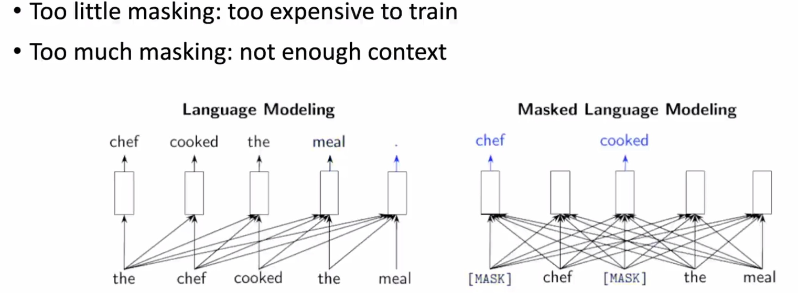
            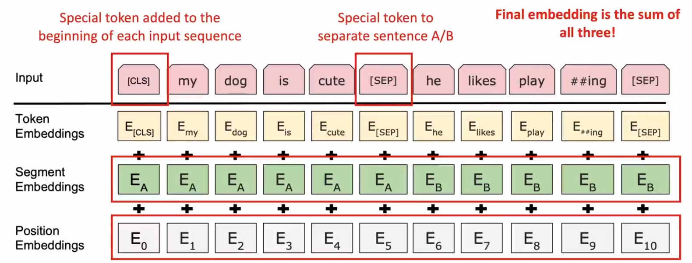

    -   **Encoder-Decoder (例如 T5)**:
        -   **架构**: 使用完整的 Transformer 编码器-解码器结构。
        -   **预训练任务**: 提出 **Text-to-Text** 统一框架，将所有 NLP 任务都转化为“文本到文本”的生成问题。例如，翻译任务是 `translate English to German: ...`，分类任务是 `sentiment: ...`。
        -   **适用场景**: 适用于需要基于输入序列生成新序列的复杂任务，如翻译、摘要、对话等。
            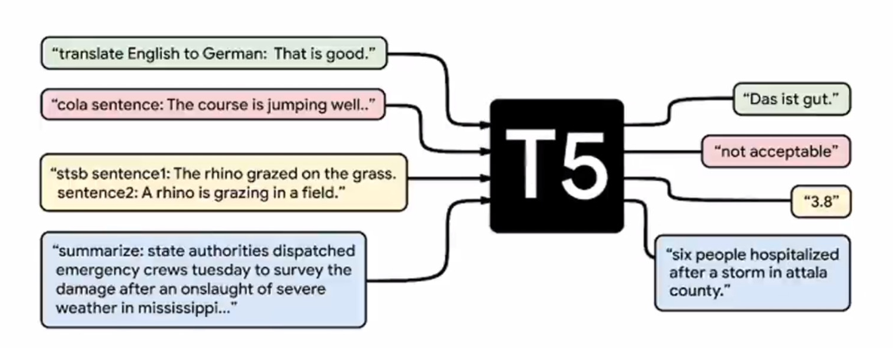

    -   **Decoder-only (例如 GPT)**:
        -   **架构**: 只使用 Transformer 的解码器部分。
        -   **预训练任务**: **标准的从左到右自回归语言模型 (Standard Auto-regressive LM)**。即根据前面的所有词，来预测下一个词。
        -   **适用场景**: 天然适合**文本生成** (NLG) 任务。
            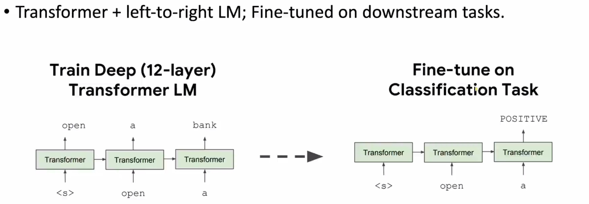

#### b. 三种预训练模式总结

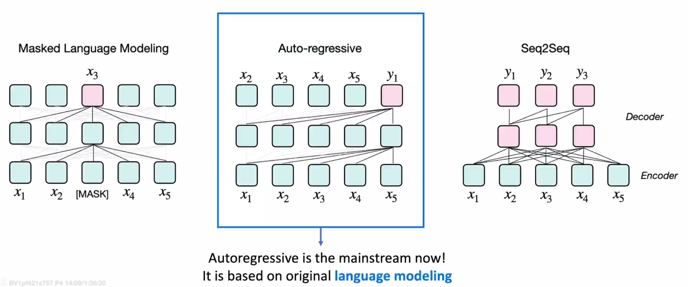

| 模式 | 代表模型 | 核心思想 | 优点/缺点 |
| :--- | :--- | :--- | :--- |
| **Masked Language Modeling (MLM)** | BERT, RoBERTa | “填空题”，预测被遮盖的词。 | **优点**: 深度双向上下文。**缺点**: 预训练与下游生成任务存在差异；`[MASK]` 标记在真实文本中不存在。 |
| **Auto-regressive LM** | **GPT 系列 (主流)** | “文字接龙”，预测下一个词。 | **优点**: 非常适合文本生成。**缺点**: 单向上下文，无法直接利用未来的信息。 |
| **Sequence-to-Sequence (Seq2Seq)** | T5, BART | “改写题”，将损坏或变换的输入序列还原成原始序列。 | **优点**: 灵活，能统一多种任务。**缺点**: 结构和训练相对复杂。 |

#### c. 语言建模与 GPT 的发展

-   **衡量指标**: **困惑度 (Perplexity, PPL)** 是衡量语言模型性能的常用指标。它表示模型对于预测下一个词有多“困惑”。PPL 越低，模型性能越好。

-   **GPT 系列的演进**:
    -   **GPT-1**: 奠定了 **“无监督预训练 + 下游任务微调”** 的范式。证明了基于 Transformer 的生成式预训练的有效性。
        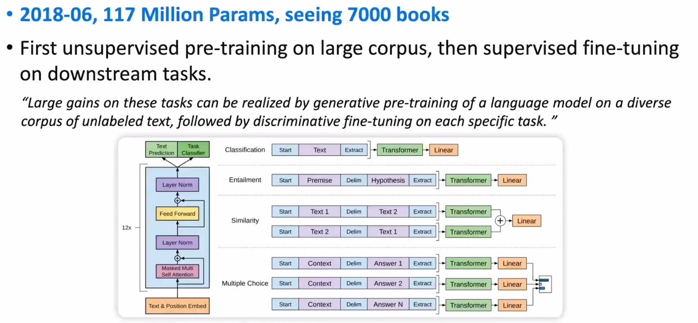
    -   **GPT-2**: 验证了语言模型的**可扩展性 (Scalability)**。通过简单地扩大模型规模和数据量，GPT-2 在未经过任何微调的情况下，展现出了在多种任务上的零样本 (Zero-shot) 能力。
        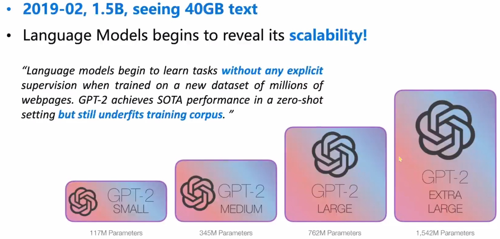
    -   **GPT-3**: 发现了大模型的**涌现能力 (Emergent Ability)**。当模型规模达到一定程度（如 175B 参数），它展现出了惊人的**上下文学习 (In-context Learning)** 能力，即通过在提示 (Prompt) 中提供几个示例 (Few-shots)，就能很好地完成新任务，无需更新模型参数。
    -   **Instruct-GPT & ChatGPT**: 引入了**对齐 (Alignment)** 的概念。通过指令微调和人类反馈的强化学习 (RLHF)，让模型学会遵循人类的指令，输出更符合人类偏好、更有用、更无害的内容。这使得零样本 (Zero-shot) 交互成为可能。
    -   **GPT-4**: 进一步验证了 **Scaling Law**：更大的模型、更多的数据、更长的训练可以带来持续的性能提升，并涌现出更强大的能力。

#### d. 训练细节
-   **超参数 (Hyperparameters)**: 包括学习率、批量大小 (batch size)、训练步数等，对模型最终性能至关重要。
-   **数据集配比 (Dataset Mixture)**: 预训练使用的数据来源非常广泛（网页、书籍、代码等），不同来源数据的混合比例会影响模型的知识结构和能力。
-   **并行计算 (Parallel Computing)**: 训练巨型模型必须使用并行策略。
    -   **数据并行 (Data Parallelism)**: 将数据分发到多个 GPU 上，每个 GPU 独立计算梯度，然后同步更新。
    -   **模型并行 (Model Parallelism)**: 将模型本身切分到不同 GPU 上，适用于单个 GPU 无法装载整个模型的场景。

### 2. 后训练 / 对齐 / 微调 (Post-training / Align / Fine-tuning)

#### a. 定义
**对齐 (Alignment)**: 指的是让预训练好的大模型（LLM）的行为和输出，能够符合人类的意图、价值观和偏好。简而言之，就是让 AI 对特定的输入，能输出人类**想要**的内容，而不是仅仅做语言上的概率接龙。

#### b. 对齐技术的分类
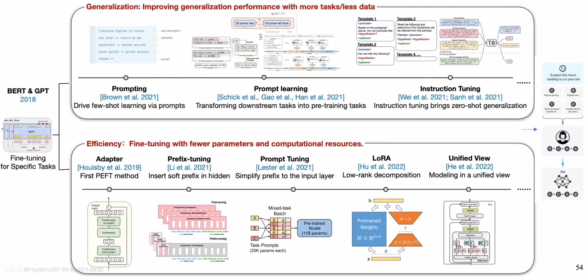

主要分为两大方向：追求**泛化性**和追求**效率**。

##### i. 泛化性 (Generalization): 提升模型听懂话、跨任务的能力

-   **指令微调 (Instruction Tuning)**:
    -   **核心思想**: 从“单任务的小样本学习”转向“跨任务的零样本泛化”。通过收集或构造大量的 **“指令-输出”** 数据对，来微调预训练模型。这教会了模型“听懂指令”和“举一反三”的能力。
    -   **关键**: **做高质量的指令数据是核心**。Alpaca、Vicuna 等项目就是通过这种方式，用相对较小的代价让开源模型获得了媲美 ChatGPT 的对话能力。

-   **人类反馈的强化学习 (Reinforcement Learning from Human Feedback, RLHF)**:
    -   **目标**: 让模型学习人类复杂的、难以用规则描述的偏好。
    -   **步骤**:
        1.  **收集偏好数据**: 针对同一个提示，让模型生成多个回答，然后由人类标注员对这些回答进行**排序**，指出哪个更好。
        2.  **训练奖励模型 (Reward Model, RM)**: 用收集到的偏好数据，训练一个模型。这个 RM 的任务是给任何一个“提示-回答”对打分，分数越高代表越符合人类偏好。
        3.  **强化学习微调**: 将奖励模型作为“环境”，使用强化学习算法（如 PPO）来微调原始的 LLM。LLM 会不断尝试生成新的回答，如果 RM 给出高分，就调整参数鼓励这类回答，反之则抑制。
        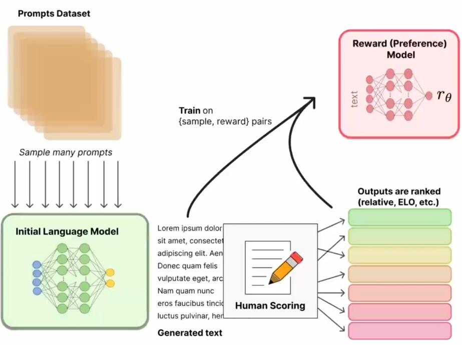

##### ii. 效率 (Efficiency): 参数高效微调 (Parameter-Efficient Fine-Tuning, PEFT / Delta Tuning)

-   **核心思想**: 在微调时，**冻结**预训练模型的绝大部分参数，只训练一小部分新增的或特定的参数。
-   **优点**: 极大降低了微调的计算和存储成本；缓解了灾难性遗忘问题。

-   **主要方法**:
    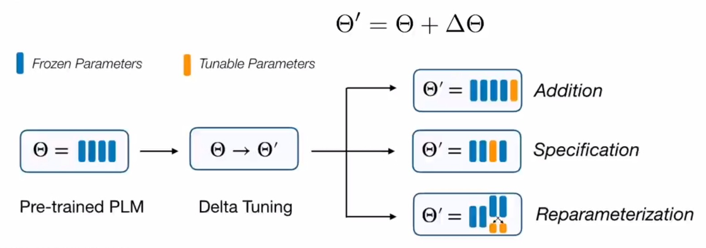
    -   **Addition-based (引入新增参数)**:
        -   **Adapter Tuning**: 在 Transformer 的子层之间插入小型的“适配器”模块，只训练这些适配器。
            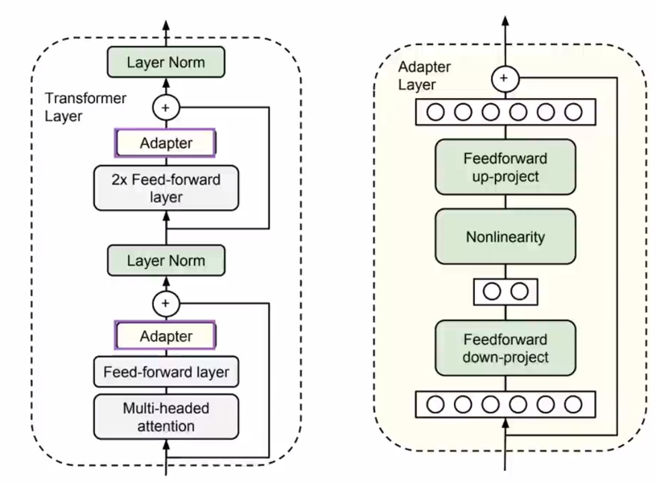
            
        -   **Prefix-Tuning / Prompt-Tuning**: 不改变模型结构，而是在输入层添加可训练的、连续的虚拟 Token (即 Prefix 或 Prompt)。
        -   **LoRA (Low-Rank Adaptation)**: 这是目前**最主流**的高效微调方法。
            -   **思想**: 它假设模型在微调时，其参数矩阵的变化量是**低秩 (Low-Rank)** 的。因此，可以用两个更小的低秩矩阵 (A 和 B) 的乘积来模拟这个变化量 `ΔW = B * A`。
            -   **实现**: 训练时只训练 A 和 B，推理时可以将 `B*A` 加回到原始权重 `W` 上，不引入任何额外的计算延迟。
            
            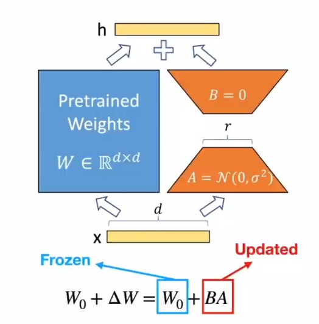