## L5：大模型前沿架构

### 1. 检索增强生成 (Retrieval-Augmented Generation, RAG)

#### a. 引入：为什么需要 RAG？
直接使用大语言模型（LLM）会遇到一些固有问题，RAG 旨在解决这些问题：
-   **幻觉 (Hallucination)**: LLM 有时会“一本正经地胡说八道”，编造不存在的事实。RAG 通过引入外部的、可验证的知识源来 grounding 模型，使其回答基于事实。
-   **知识过时**: LLM 的知识截止于其训练数据的最后日期。RAG 可以连接到实时更新的数据库，从而提供最新的信息。
-   **领域知识缺乏与微调的弊端**:
    -   **领域数据微调**: 虽然可以向模型注入特定领域的知识，但成本高昂，且存在**数据隐私泄露**的风险。
    -   **指令微调 (Self-instruct)**: 构造的数据质量参差不齐，模型可能只是**模仿了回答的形式**，而没有真正学会知识。

#### b. RAG 的框架
RAG 将问题的回答过程分解为“检索”和“生成”两个阶段。

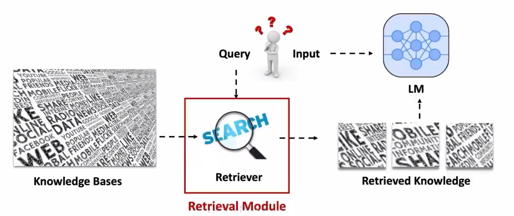

**i. 信息检索 (Information Retrieval)**
此阶段的目标是从海量文档中快速、准确地找到与用户问题最相关的几个片段。

-   **检索模型 (Retrieval Models) / 向量数据库**:
    -   **稠密检索 (Dense Retrieval)**:
        -   **原理**: 使用双塔模型（Bi-encoder）将问题（Query）和文档（Document）分别编码成高维度的语义向量。然后通过计算向量间的**余弦相似度**来找出最相关的文档。
        -   **实现**: 通常使用 FAISS (Facebook AI Similarity Search) 这类高效的向量索引库来加速查找。
        -   **训练**: 检索器（通常是 BERT 类的编码器）通过**对比学习**进行训练，目标是让正样本对（相关的问题-文档）的向量更接近，负样本对的向量更疏远。
        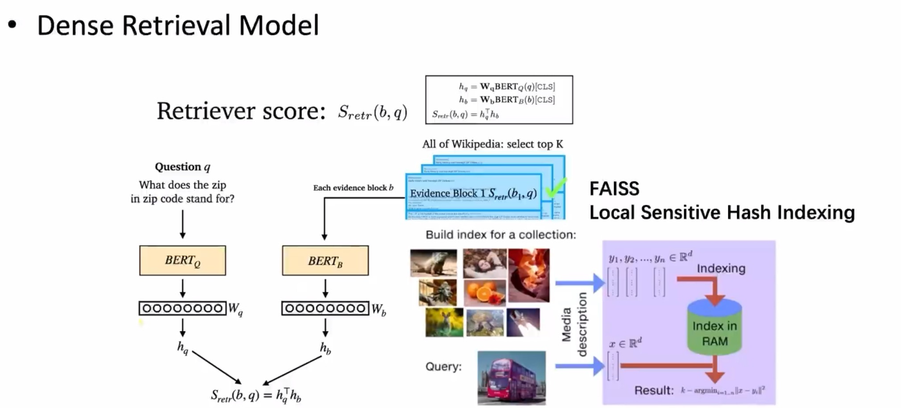
    -   **稀疏检索 (Sparse Retrieval)**: 基于关键词匹配的传统方法，如 **TF-IDF** 和 **BM25**，速度快，对于关键词明确的查询效果好。

-   **重排序模型 (Reranking Models)**:
    -   **原理**: 在检索模型召回（例如）前 100 个文档后，使用一个更强大但更慢的单塔模型（Cross-encoder）对这 100 个文档进行精确排序。该模型会同时处理问题和文档，从而更好地判断相关性。

**ii. 信息输出 (Generation)**
LLM 利用检索到的信息来生成最终答案。

-   **In-context Learning (主流)**: 最简单直接的方法，将检索到的文档片段作为上下文（Context）直接拼接到用户的提问（Prompt）中，然后让 LLM 基于这些信息回答。
-   **微调 (Fine-tuning)**: 将“问题-检索文档-答案”作为数据对，对 LLM 进行微调。
-   **REPLUG**: 一种更精巧的方法，它不直接拼接文本，而是在**概率层面**融合。LLM 和一个基于检索文档的外部语言模型会分别计算下一个词的概率分布，然后将两个分布进行插值或累加，得到最终的输出概率。
    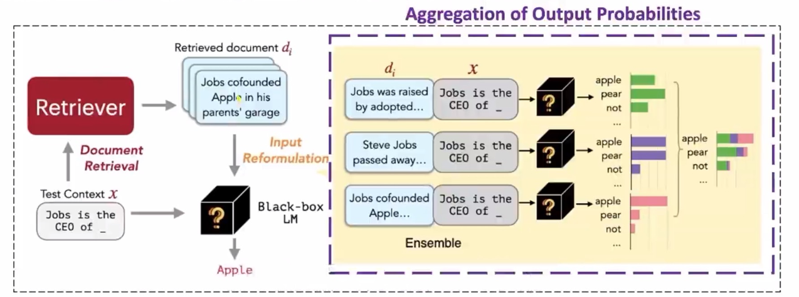
-   **扩展**: RAG 的思想可以扩展到多模态数据，如检索相关的图片、代码片段等来辅助生成。

#### c. RAG 的挑战与解决方案

**i. 何时检索 (When to Retrieve)**

-   **被动检索 (Passive Retrieval)**: 在生成答案**之前**，一次性完成所有检索。
-   **主动检索 (Active Retrieval / FLARE)**:
    -   **思想**: 在生成过程中，当模型感到“不确定”时，主动触发检索。
    -   **FLARE 框架**: 模型按正常方式生成答案，当它预测的下一个词的概率**低于某个阈值**时，就暂停生成。它会利用已生成的内容作为新的查询，去**检索**缺失的信息，然后基于新信息**重新生成**后续内容。
        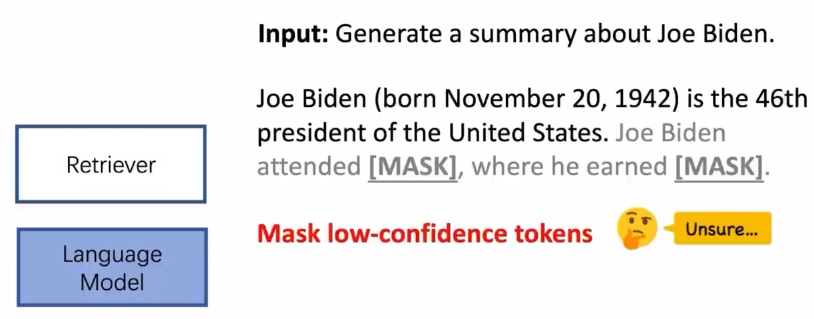
        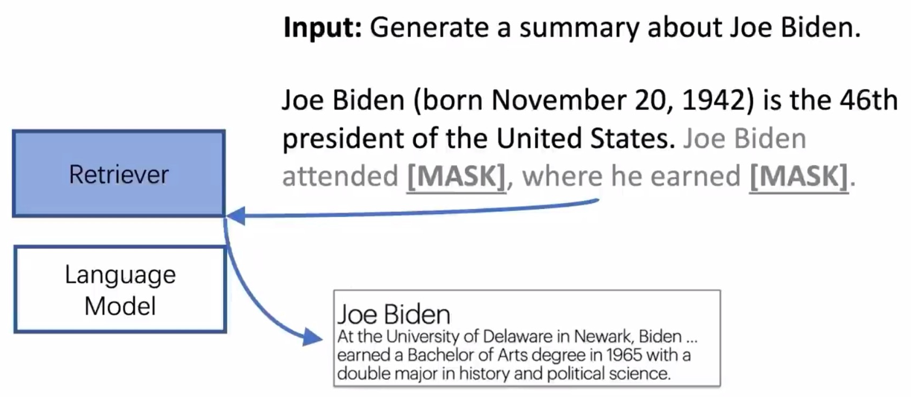
        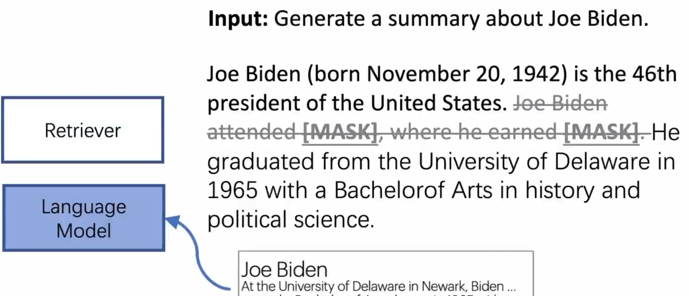

**ii. 如何使用检索到的信息 (How to Use Retrieved)**

-   **噪音问题 (Noise)**: 检索到的文档可能包含无关甚至错误的信息，或者上下文的顺序会影响 LLM 的注意力（“迷失在中间”问题）。
    -   **解决方案**: 在送入 LLM 之前，先利用 **LLM 本身对检索到的上下文进行去噪、总结或重排序**。
        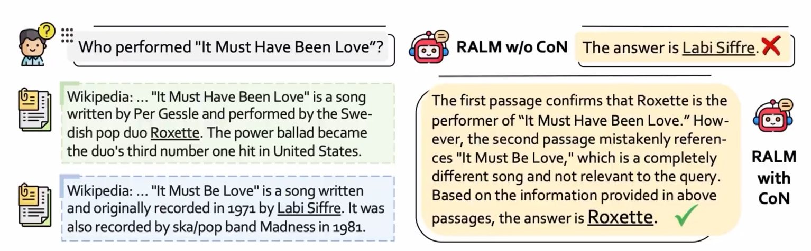
-   **用户意图不明确**: 用户的查询（Query）通常很短，可能无法精确匹配到最佳文档。
    -   **解决方案**: **迭代式检索**。首先用原始 Query 检索，然后让 LLM 基于检索结果**重写或扩展** Query，再进行下一轮检索，循环往复。
        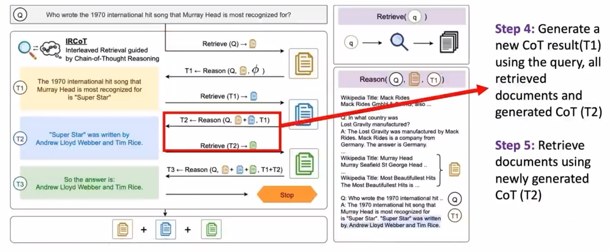

### 2. 混合专家模型 (Mixture of Experts, MoE)

#### a. 动机 (Motivation)
-   **生物启发**: 模仿人脑的**稀疏激活**机制。当我们处理任务时，大脑中只有特定的、相关的区域会被激活，而不是整个大脑都在工作。
-   **模型扩展**: 旨在构建一个总参数量巨大，但每次推理时计算量又保持不变的模型，实现**稀疏化**和**模块化**。

#### b. MoE 架构
-   **定义**: MoE 的核心是将 Transformer Block 中的前馈网络层（FFN）替换为多个并行的 FFN，这些并行的 FFN 被称为**“专家” (Experts)**。同时，引入一个轻量的**“门控网络”或“路由器” (Router)**。
-   **工作流程**:
    1.  当一个 Token 的表示向量进入 MoE 层时，路由器会预测这个 Token 应该被发送给哪个（或哪几个）专家处理。
    2.  Token 的向量被加权发送给被选中的专家。
    3.  各专家独立处理接收到的 Token。
    4.  最后，将专家的输出根据路由器的权重进行加权求和，得到 MoE 层的最终输出。
        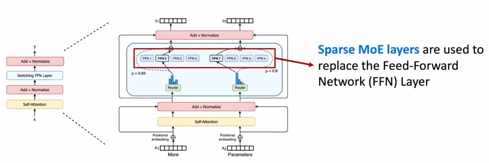
        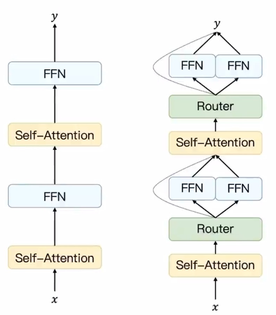
-   **优势**: 在推理时，每个 Token 只需要激活少数几个专家（例如，8个专家中激活2个），因此计算成本与一个标准的小模型相当，但由于总参数量巨大，其模型容量和性能远超标准模型。

### 3. LLM for Long Sequences (长文本处理)

#### a. 挑战 (Challenge)
标准 Transformer 的自注意力机制需要计算序列中每两个 Token 之间的注意力分数，其计算和内存复杂度都是序列长度 N 的**平方**，即 **O(N²)**。这使得处理长文本（如整本书、代码库）的成本极高。

#### b. 高效的架构

-   **稀疏自注意力 (Sparse Attention)**:
    -   **思想**: 限制每个 Token 只与部分其他 Token 计算注意力，而不是全部。
    -   **方法**:
        -   **滑动窗口注意力 (Sliding Window Attention)**: 每个 Token 只关注其周围固定大小的邻居。
        -   **全局注意力 (Global Attention)**: 允许少数“重要”的 Token (如 `[CLS]`) 关注整个序列。
        -   **内容相关注意力 (Content-based Attention)**: 根据内容动态决定注意力模式。
    -   **应用**: Longformer、BigBird 等模型。现在通常在预训练阶段就引入滑动窗口注意力，或者在微调稠密模型时采用全局+滑动窗口的混合策略。
        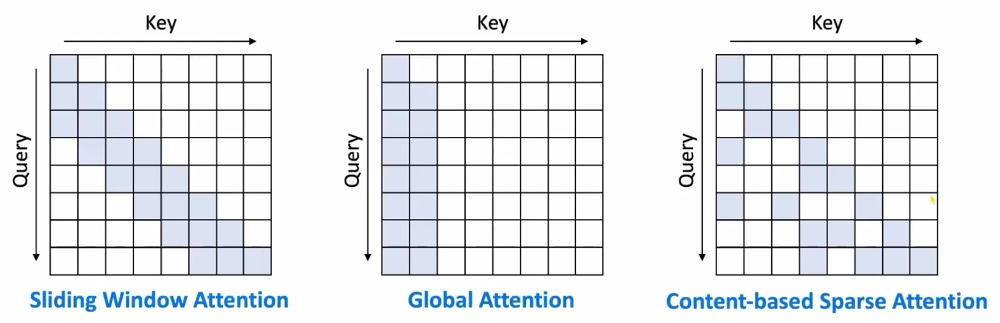

-   **基于记忆的模型 (Memory-based Model)**:
    -   **思想**: 引入外部记忆模块来缓存历史信息。模型在处理当前片段时，可以访问和更新这个记忆，从而打破对整个历史输入的直接依赖，将复杂度限制到**线性**。
        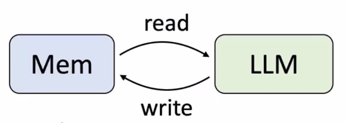

-   **线性注意力 (Linear Attention)**:
    -   **思想**: 通过数学变换，将 Softmax 注意力 `softmax(Q * K^T) * V` 近似为 `Q * (K^T * V)`。通过改变计算顺序，避免了计算 `N x N` 的注意力矩阵，使复杂度降为**线性 O(N)**。
        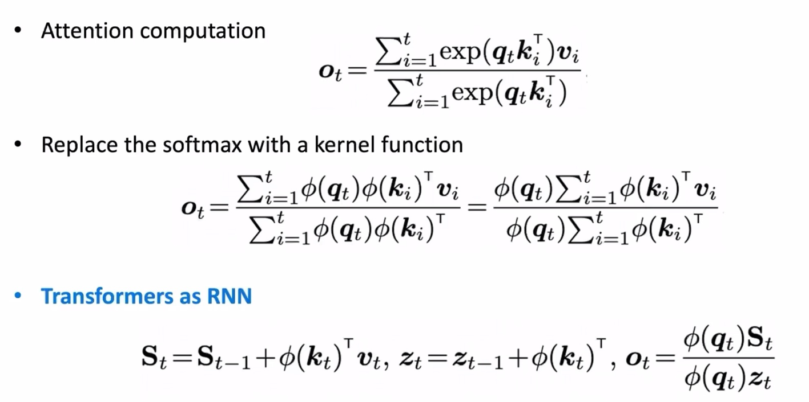

-   **状态空间模型 (State Space Model, SSM)**:
    -   **思想**: 借鉴自经典控制理论，将序列建模为一个随时间演化的**隐状态 (hidden state)**。当前时刻的输出只依赖于当前输入和上一时刻的隐状态。
    -   **代表**: Mamba。它通过高效的硬件感知算法，实现了**线性时间复杂度**和**并行化训练**，在长文本任务上表现出色，被认为是 Transformer 的有力竞争者。
        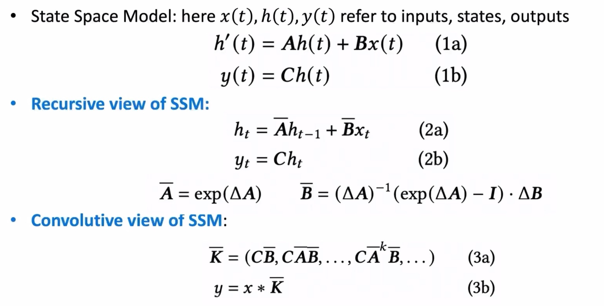

### 4. Scaling Law (规模法则)

#### a. 定义
-   **Scaling Law**: 指的是一种**经验规律**，它表明大语言模型的**性能（通常用交叉熵损失 Loss 来衡量）**会随着三个关键因素的增加而**可预测地**提高：**模型大小（参数量）、数据集大小和计算量**。
-   **Predictable Scaling**: 这种可预测性极具价值，它允许我们通过训练一系列**小模型**，拟合出一条性能曲线，然后用这条曲线来**预测**一个规模大得多的模型在投入巨大资源训练后能够达到的性能，从而指导模型设计和资源分配。

#### b. Scaling Law vs. 涌现能力 (Emergent Abilities)
这是两个相关但不同的概念：
-   **Scaling Law 关注的是连续的、可预测的性能变化**。它描述的是模型的**损失（Loss）**如何平滑地下降。
-   **Emergent Abilities 关注的是离散的、不可预测的能力跃迁**。它指的是当模型规模达到某个临界点后，突然出现的、在小模型上完全不存在的新能力（如多步推理、上下文学习）。这通常是基于**任务的最终正确性（Accuracy）**来评判的，而不是平滑的损失曲线。

简单来说，Scaling Law 告诉我们模型“学得有多好”（损失多低），而涌现能力告诉我们模型“学会了什么新东西”（能做对什么任务）。
