# L6：多模态大模型

## 1. 引入 (Introduction)

### ① 模态 (Modality)
模态是指信息的表现形式或感官通道。在人工智能领域，常见的模态包括：
*   **文本 (Text):** 如语言、文字、代码。
*   **图像 (Image):** 如照片、绘画、图表。
*   **音频 (Audio):** 如语音、音乐、环境声。
*   **视频 (Video):** 动态的图像和音频序列。
*   **其他:** 如3D模型、表格、传感器信号（如温度、压力）等。

每一种模态都承载着独特的信息和语义。

### ② 为什么需要多模态学习 (Why Multimodal Learning?)
世界是多模态的。人类通过多种感官（视觉、听觉、触觉等）协同感知和理解世界。仅依赖单一模态的AI模型（如纯文本的LLM）理解世界的方式是片面的。

多模态学习的核心优势在于：
*   **更全面的理解:** 融合不同模态的信息可以消除歧义，获得比任何单一模态都更丰富、更准确的理解。例如，图片可以为文字提供直观的上下文。
*   **知识的互补与增强:** 不同模态可以相互补充、相互验证。比如，一段语音和其转录的文字结合，可以提供情感（语调）和内容（文字）的双重信息。
*   **催生新的应用:** 促成了许多过去难以实现的任务，如根据图片回答问题、通过文字描述生成视频等，让AI的能力边界极大扩展。

---

## 2. 多模态任务 (Multimodal Tasks)

### a. 图生文 (Image to Text Generation)
#### ① Image Caption (图像描述)
该任务是为给定的图片生成一段简洁、准确、自然的文字描述。这要求模型不仅能识别图像中的物体，还要理解它们之间的关系和场景的整体含义。
*   **输入:** 一张图片
*   **输出:** 一段描述性文字 (e.g., "一只猫懒洋洋地躺在洒满阳光的地毯上。")

#### ② Visual Question Answering (VQA, 视觉问答)
该任务要求模型根据一张图片和一个关于该图片的问题，生成相应的自然语言回答。这比图像描述更进一步，需要模型具备视觉感知、语言理解和逻辑推理的能力。
*   **输入:** 一张图片 + 一个自然语言问题 (e.g., "图片里有几只猫？")
*   **输出:** 一个自然语言回答 (e.g., "两只。")

### b. 文生图 (Text to Image Generation)
该任务根据一段文字描述，生成一张与之内容和风格相符的图片。这是生成式AI的一个热门方向，代表性模型如OpenAI的DALL-E系列、Midjourney和Stable Diffusion。
*   **输入:** 一段描述性文字 (e.g., "一个宇航员骑着马在月球上，超现实主义风格。")
*   **输出:** 一张图片

### c. 跨模态检索 (Cross-modal Retrieval)
该任务利用一种模态的信息来检索另一种或多种模态的相关内容。
*   **图文检索:**
    *   **Text-to-Image:** 输入文字，检索出最相关的图片。
    *   **Image-to-Text:** 输入图片，检索出最相关的文字描述。
*   **应用:** 电商平台的"以图搜图"功能、搜索引擎的图文混合搜索。

### d. 其他 (Other Tasks)
*   **① Text-Video Tasks:** 涉及文本和视频的交互，如视频描述生成 (Video Captioning)、视频问答 (Video QA)、文本生成视频 (Text-to-Video) 等。
*   **② Speech Conversion:** 广义上指涉及语音模态的转换任务，如自动语音识别 (ASR, Speech-to-Text)、语音合成 (TTS, Text-to-Speech)、语音翻译等。

---

## 3. 代表性工作 (Representative Works)

### a. 经典学习范式 (Classic Learning Paradigms)

#### ① 跨模态注意力 (Cross-modal Attention)
这是一种关键机制，用于捕获不同模态元素之间的对齐关系。例如，在处理图文对时，模型可以利用注意力机制学习到文本中的“狗”这个词符号对应到图片中狗所在的视觉区域。
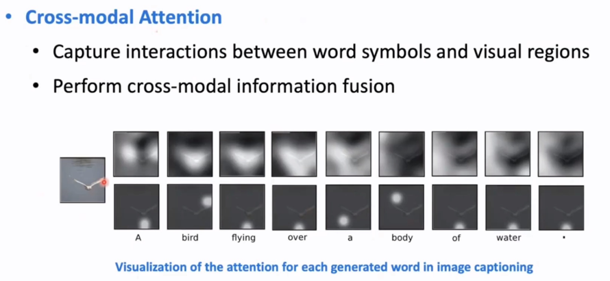

*   **BERT时代的多模态:** 早期工作通过在Transformer模型（如BERT）中加入跨模态注意力层，对大规模的图像-文本对进行预训练，然后在下游任务（如VQA）上进行微调，以学习图文的联合表示。
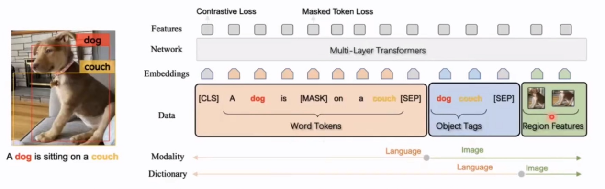
*   **LLM时代的多模态:** 现代架构则利用强大的预训练语言模型（LLM）作为大脑，将视觉特征通过一个适配器（Adapter）或交叉注意力模块“注入”到LLM中。通过指令微调和人类反馈强化学习（RLHF），模型可以处理更通用的多模态任务。
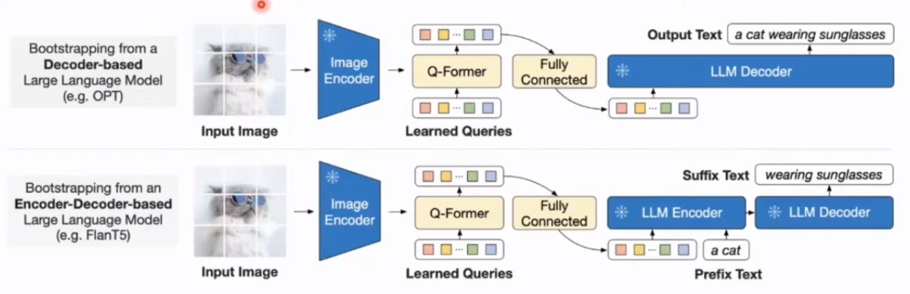

#### ② 跨模态表示学习 (Cross-modal Representation Learning)
该范式的目标是通过设计巧妙的代理任务（Pretext Task），将不同模态的信息映射到同一个共享的语义空间（Shared Semantic Space）中。在这个空间里，语义上相似的内容（无论来自哪个模态）它们的表示向量在空间上是相近的。对比学习（Contrastive Learning）是实现这一目标的核心技术。
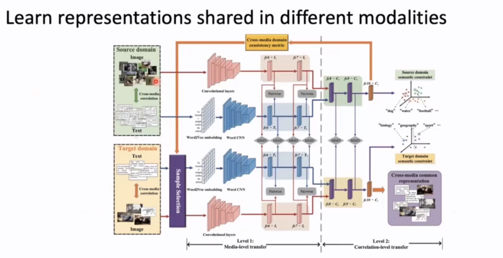

### b. BERT时代 (The BERT Era)

#### ① Cross-modal Attention-based Models (Single-stream)
这类模型在早期就将不同模态的特征进行拼接（Concatenate），然后送入一个单一的Transformer编码器进行联合处理。
*   **Oscar:** 该模型的一大创新是引入了从图像中检测到的物体标签（Object Tags）作为“锚点”，帮助模型更好地对齐图像区域和文本词语，从而学习到更精确的图文语义表示。
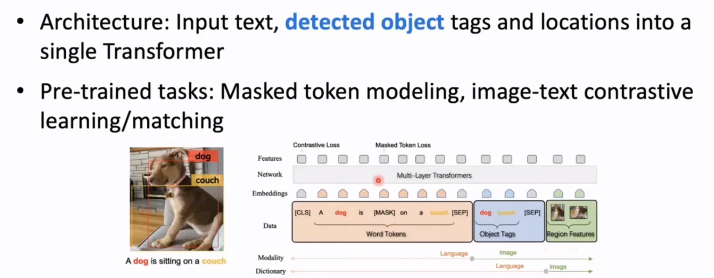

#### ② Joint Representation-based Models (Two-stream)
这类模型通常为每个模态使用独立的编码器（如图像用CNN/ViT，文本用BERT），然后通过一个特定的模块或损失函数（如对比损失）来对齐它们的表示。
*   **CLIP (Contrastive Language-Image Pre-training):** 这是一个里程碑式的工作。CLIP使用一个图像编码器和一个文本编码器，在海量的（4亿）网络图文对上进行对比学习。其目标是让匹配的图文对在表示空间中的余弦相似度最大化，不匹配的则最小化。CLIP最强大的地方在于其惊人的**零样本（Zero-shot）**泛化能力，无需微调就能在各种分类任务上取得良好效果。至今，CLIP的视觉编码器仍是众多LLM时代多模态模型（MLLM）的首选。
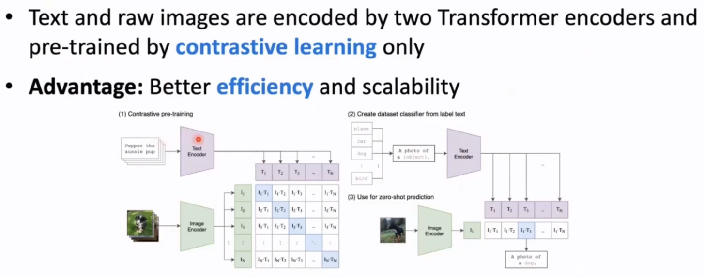

### c. LLM时代 (The LLM Era)
进入LLM时代，多模态架构的主流范式发生了转变：将一个强大的、**冻结的**视觉编码器（如CLIP ViT）和一个强大的、**冻结的**大语言模型（LLM）通过一个轻量级的、可训练的**适配器模块（Adapter）**连接起来。
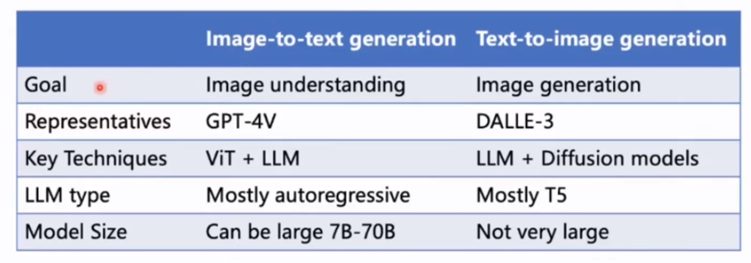

#### ① Image to Text: GPT-4V, LLaVA
*   **架构:** `ViT + Adapter + LLM`。这是一种自回归（Autoregressive）的生成形式，LLM根据视觉信息和已生成的文本，逐字预测下一个词。
*   **GPT-4V(ision):** 作为闭源模型的标杆，它展示了强大的世界知识、OCR能力、复杂的视觉推理能力，并且能够处理图文交错（Interleaved Data）的输入。
*   **开源代表 (LLaVA等):** 采用类似思路，通过指令微调实现强大的对话和推理能力。

#### ② Text to Image: DALL-E 3
*   **架构:** `LLM (e.g., T5) + Diffusion Models`。
*   **思路:** DALL-E 3利用一个强大的LLM（如T5）首先对用户的输入提示（Prompt）进行“重写”和“扩充”，生成更详细、更丰富的描述，然后将这个优化后的文本表示送入一个高质量的扩散模型（Diffusion Model）进行图片生成。这极大地提升了图片与用户意图的对齐程度。

---

## 4. 前沿架构MLLM (Frontier MLLM Architectures)
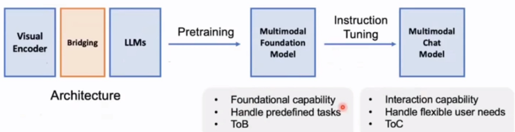

### a. 基本学习范式 (Basic Learning Paradigm)

#### ① 结构：视觉编码器 (Vision Encoder) + LLM
*   **Flamingo:**
    *   **Visual Bridging:** 它没有将所有视觉特征都输入LLM，而是通过一个**Perceiver Resampler**模块将ViT提取的视觉特征序列“压缩”成固定数量（例如64个）的潜在视觉Token。
    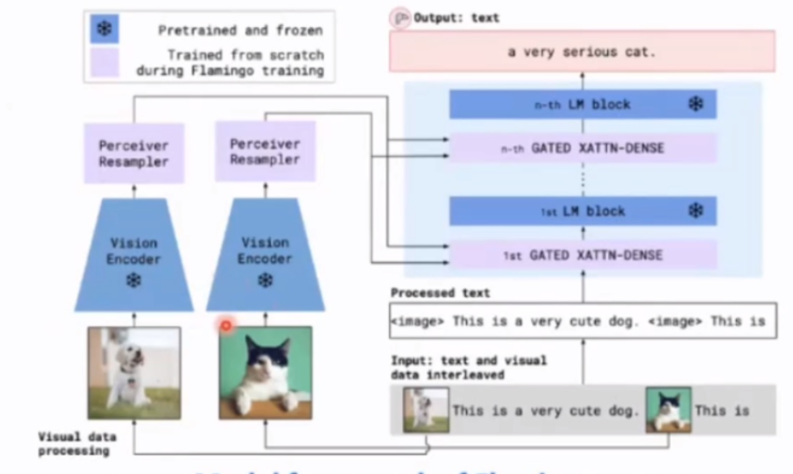
    *   **Fusion:** 在冻结的LLM的每一层（或部分层）之间，插入一个**门控交叉注意力（Gated Cross-Attention）**层。LLM的文本特征作为Query，Perceiver输出的视觉Token作为Key和Value，从而让LLM在生成文本时能够“参考”视觉信息。
    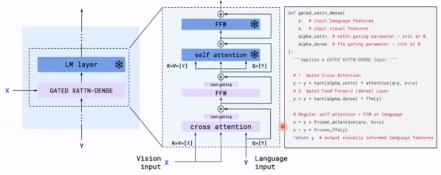
    *   **Interleaved Data:** 这种架构使其天生就能处理图文交错的网页数据，进行少样本学习。
    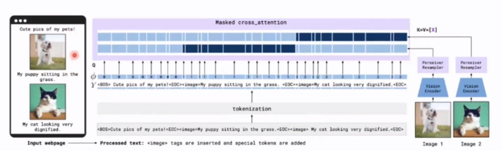

*   **BLIP-2:**
    *   **框架:** BLIP-2的创新在于提出了一种高效连接**冻结Image Encoder**和**冻结LLM**的方法，其核心是**Q-Former**。
    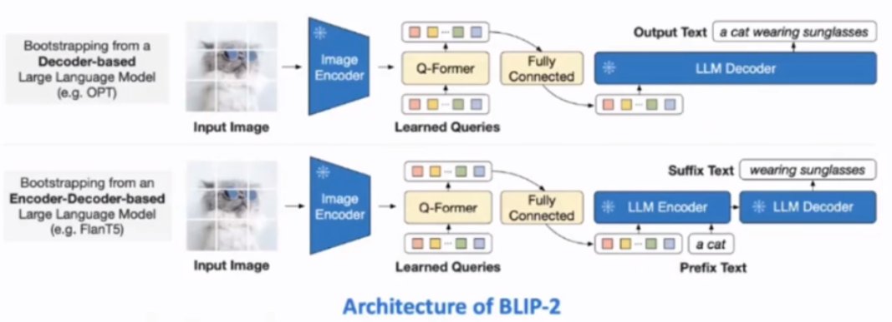
    *   **Q-Former:** 这是一个轻量级的Transformer，它引入了一组可学习的Query向量。这些Query向量通过交叉注意力与冻结的图像编码器输出的视觉特征进行交互，从而提取出与文本最相关的视觉信息。Q-Former充当了一个信息瓶颈，将海量的视觉信号“翻译”成LLM能够理解的、固定长度的“软提示”。这种设计使得预训练非常高效。
    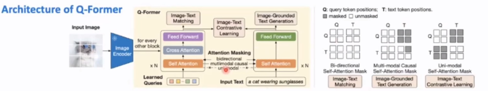

*   **LLaVA系列 (Large Language and Vision Assistant):**
    *   **框架:** LLaVA是开源社区的里程碑。它采用了最简洁的架构：一个冻结的CLIP ViT + 一个简单的线性投影层（MLP）+ 一个冻结的LLM（如Vicuna）。
    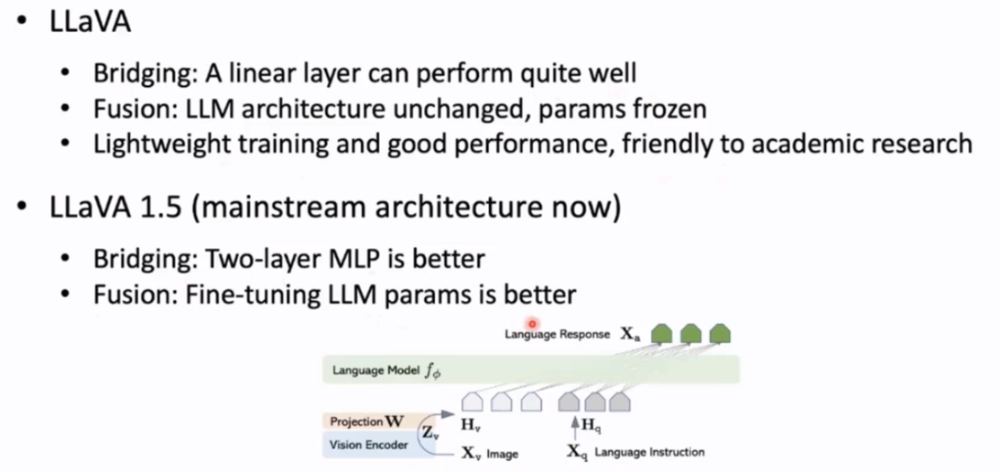
    *   **核心贡献:** LLaVA的成功关键在于**训练方法**。它首次证明了**多模态指令微调（Instruction Tuning）**的巨大潜力。

#### ② 训练 (Training)
*   **指令微调 (Instruction Fine-tuning):** 这是提升MLLM对话和遵循指令能力的关键步骤。由于高质量的人工标注多模态指令数据非常昂贵，LLaVA开创性地使用强大的**Text-Only GPT-4**来“脑补”图片信息，生成图文并茂的对话、描述和推理数据。例如，给定一张图片的描述（或Caption），让GPT-4生成相关的问答对。用这种半自动生成的数据集来训练模型，极大地降低了成本，并取得了惊人的效果。

### b. 前沿技术 (Frontier Technologies)

#### ① 高分辨率图像感知和OCR (High-resolution Image Perception and OCR)
*   **挑战:** 标准的ViT通常处理224x224或336x336的低分辨率图像，这会导致图像中的精细细节（如小物体、文字）丢失，严重影响模型的OCR能力和细粒度识别能力。
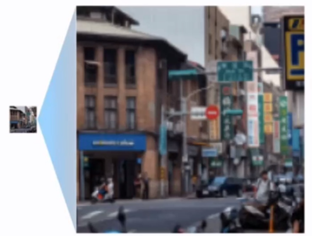
*   **LLaVA-UHD (Ultra High Definition):** 该模型提出了一种有效的策略来处理高分辨率图像，而无需改变模型主体结构。它将高分辨率图像切分成多个小图块（Patches），与压缩后的完整图像一起送入视觉编码器。通过精巧的位置编码和特征组织，模型可以在保持全局视野的同时，“聚焦”于局部细节，从而在OCR和细粒度VQA任务上取得了SOTA性能。
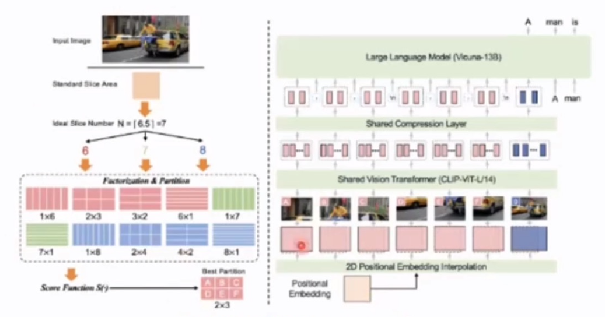

#### ② 多语言多模态能力 (Multilingual Multimodal Capacity)
*   **挑战:** 大多数主流MLLM主要以英语为中心。
*   **VisCPM:** 这是一个代表性的开源工作，致力于构建强大的中英双语多模态模型。它通过在中英双语的图文数据上进行预训练和微调，使得模型不仅能用中文或英文进行视觉对话，还具备了一定的跨语言理解能力。
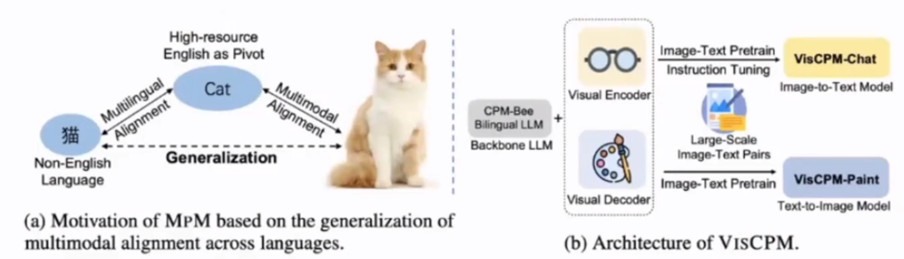

#### ③ 多模态人类反馈强化学习 (Multimodal RLHF)
*   **挑战:** MLLM一个广为人知的问题是**幻觉（Hallucination）**，即模型会“编造”出图片中不存在的细节。
*   **RLHF-V (RL from Human Feedback for Vision):** 这是解决幻觉问题的前沿方法。
    1.  **训练奖励模型 (Reward Model):** 让人类对模型生成的多个关于同一张图片的不同回答进行排序打分（哪个更准确、更真实）。利用这些偏好数据，训练一个奖励模型，使其能够评估生成文本的质量。
    2.  **强化学习微调:** 使用PPO等强化学习算法，利用训练好的奖励模型作为回报信号，对MLLM进行微调，鼓励模型生成得分更高的（即更符合人类偏好的、更忠于事实的）输出。
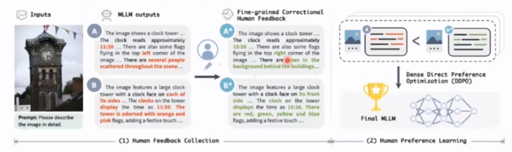

### c. 未来方向 (Future Directions)
*   **视频作为第一等公民:** 真正实现对长视频的深入理解、推理和摘要，而不仅仅是处理短片或采样帧。
*   **多模态Agent:** 赋予模型“手”和“脚”，让它不仅能“看”和“说”，还能在数字（如浏览网页、操作软件）或物理世界中执行任务。
*   **世界模型 (World Models):** 构建能够预测世界动态变化的内在模型，实现更高层次的规划和推理能力，例如预测视频中接下来会发生什么。
*   **效率和端侧部署:** 开发更小、更快、更高效的MLLM，使其能够在手机、汽车等边缘设备上运行。
*   **更丰富的模态融合:** 融合音频、3D、触觉、机器人动作等更多种类的模态。
*   **解决幻觉的根本方法:** 探索除了RLHF之外，更能从根本上保证模型输出忠实于输入的机制。
