## L7：自主智能体

### **1. 简介 (Introduction)**

#### **a. 技术发展脉络**

人工智能的发展经历了一个清晰的演进过程，从早期的神经网络到深度学习，再到预训练模型，最终演化为当今功能强大的大规模预训练模型（如GPT系列）。这一进程标志着模型规模、数据量和能力的巨大飞跃。

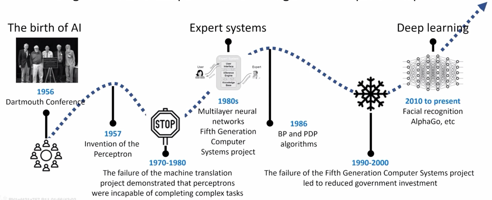

#### **b. 大语言模型（LLM）的局限性**

尽管大语言模型在自然语言处理任务上取得了巨大成功，但它们本身也存在固有的局限性：
*   **① 缺乏使用外部工具的能力 (Lack of Tool Use)**：标准的LLM无法自主调用计算器、搜索引擎、数据库或其他API来获取实时信息或执行复杂计算。
*   **② 规划能力不足 (Insufficient Planning)**：对于需要多步骤才能解决的复杂任务，LLM往往难以制定一个有效、连贯的全局计划，容易在执行过程中偏离目标。
*   **③ 协作效率低下 (Inefficient Collaboration)**：单个LLM难以模拟不同角色之间的复杂协作和动态交互，这在模拟真实世界场景（如软件开发团队）时尤为重要。

为了克服这些限制，研究者们提出了“自主智能体”的概念，旨在让大模型能够像人类一样规划、使用工具并相互协作，从而更好地融入和改变人类社会。

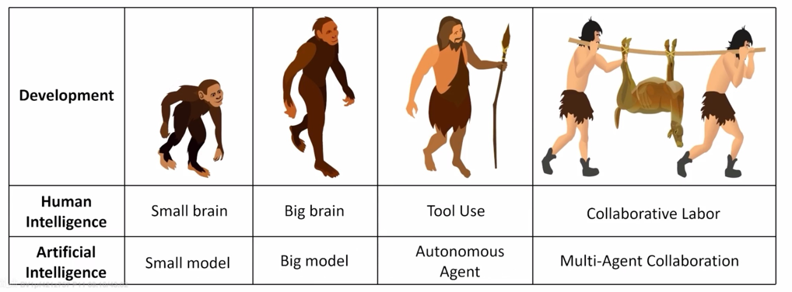

### **2. 自主智能体 (Autonomous Agents)**

#### **a. 通用框架 (Framework)**

一个典型的自主智能体通常由以下四个核心部分组成：

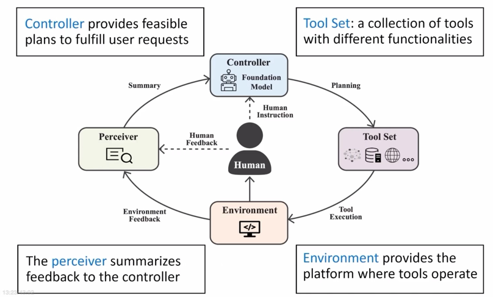

*   **① 控制器 (Controller)**：作为智能体的大脑，通常由一个LLM担任。它负责理解用户意图、分解任务、制定执行计划（Plans），并根据反馈进行动态调整。
*   **② 工具集 (Tool Set)**：提供智能体执行任务所需的功能性工具。这些工具可以是软件API（如搜索、计算、代码执行），也可以是硬件接口。
*   **③ 环境 (Environment)**：智能体执行任务和与外部世界交互的场所。例如，对于代码生成任务，环境就是一个编程工作区。
*   **④ 感知器 (Perceiver)**：负责收集和总结来自用户和环境的反馈信息，并将其传递给控制器，帮助控制器了解任务进展和外部状态，从而做出更优决策。

#### **b. 工具使用 (Tool Using)**

教会LLM使用工具是构建自主智能体的关键一步，主要有两种学习范式：

**① 模仿学习 (Imitation Learning)**

核心思想是记录人类使用工具的行为轨迹，然后通过监督学习的方式让LLM模仿这些行为。

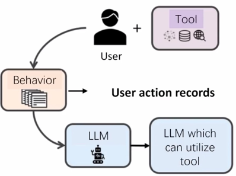

*   **代表性工作：Toolformer**
    *   **思路**：Toolformer通过一种自监督的方式学习何时以及如何调用API。它首先预定义了一系列工具API，然后鼓励模型在文本生成过程中预测并插入API调用。
    *   **核心机制**：设计了一个自监督损失函数。模型会判断一次API调用及其返回结果是否有助于减少后续文本的预测损失（即语言模型损失LM loss）。如果API调用确实能提供有用信息，使得模型更容易预测接下来的文本，那么这次调用就会被视为一个正样本，用于模型的训练。通过这种方式，LLM学会了在需要时自主调用工具来增强自身能力。

    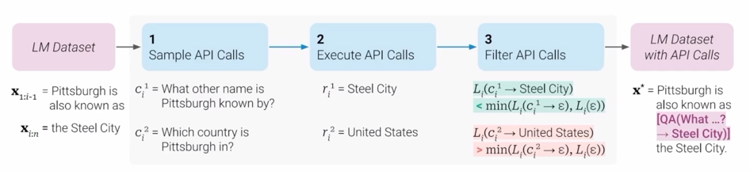

*   **代表性工作：WebCPM**
    *   **思路**：专注于浏览器环境下的网页检索任务。研究人员记录了大量人类在浏览器中为了回答开放性问题而进行的一系列操作（如点击、输入、滚动等）。
    *   **核心机制**：将这些人类行为序列作为训练数据，对LLM进行微调。最终，模型能够模拟人类的检索行为，自主地在网页上查找和整合信息，以回答复杂的问题。

    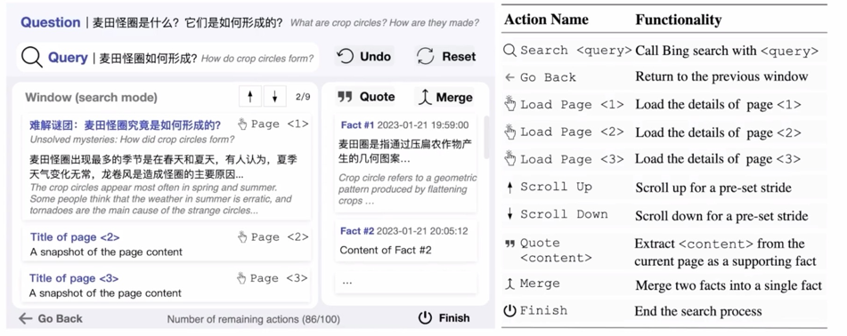
    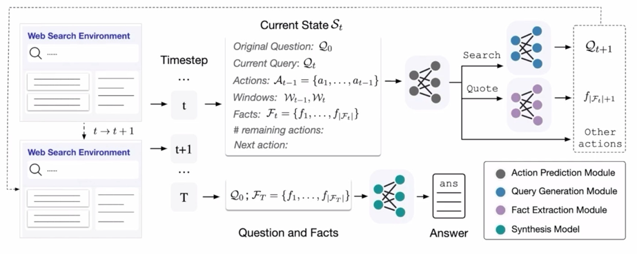

**② 教程学习 (Tutorial Learning)**

模仿学习需要大量的人工标注数据，成本高昂。教程学习旨在让LLM直接通过阅读工具的官方文档或教程来学会使用。

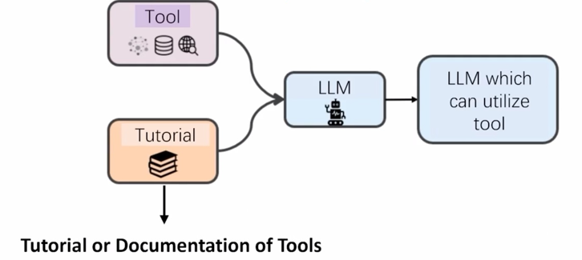

*   **代表性工作：ToolLLM**
    *   **思路**：ToolLLM构建了一个名为ToolBench的指令微调数据集。该数据集包含了大量工具以及如何调用这些工具的指令。
    *   **核心机制**：首先，研究人员标注了少量高质量的、基于工具使用手册来完成任务的示例。然后，利用这些示例对大模型进行微调，使其初步具备理解API文档并执行调用的能力。最后，通过这种方式训练出的模型可以很好地泛化到它从未见过的新工具上，只需向其提供相应的API文档即可。

    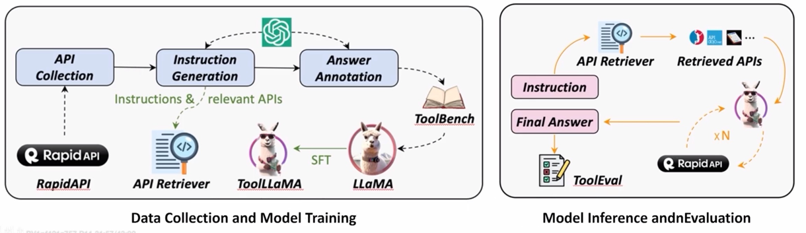

#### **c. 任务规划 (Planning)**

为了完成复杂任务，智能体需要具备规划能力。

*   **① ReAct框架 (Reasoning and Acting)**
    *   **思路**：ReAct是一种经典的规划框架，它将“思考”（Reasoning）和“行动”（Acting）结合在一起。智能体每一步都会生成一个思考过程，分析当前状况并决定下一步的行动，然后执行该行动。
    *   **局限性**：ReAct框架主要关注“下一步做什么”，缺少对任务全局的、长远的规划观念，在面对极其复杂的任务时容易陷入局部最优或迷失方向。

*   **② XAgent框架**
    *   **思路**：为了解决ReAct的局限性，XAgent引入了“双智能体”架构，将规划和执行分离。
    *   **核心机制**：
        *   **PlanAgent (规划智能体)**：负责进行宏观的、全局的任务规划，生成一个高层次的执行步骤蓝图。
        *   **ToolAgent (工具智能体)**：负责执行PlanAgent制定的具体步骤，调用相应的工具来完成子任务。
    *   这种分层架构使得XAgent既有全局视野，又能精确执行，显著提升了处理复杂任务的能力。

    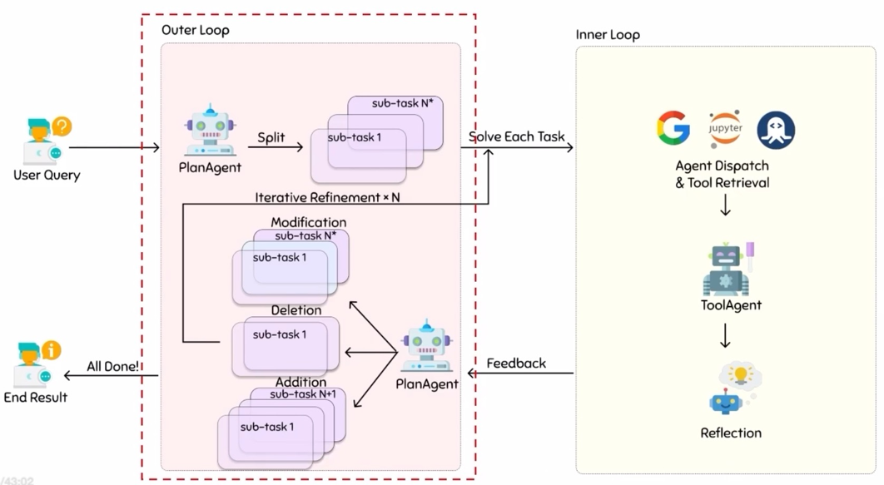

### **3. 多智能体协作 (Multi-Agent Collaboration)**

当单个智能体不足以解决问题时，就需要构建多智能体系统，让多个智能体协同工作。

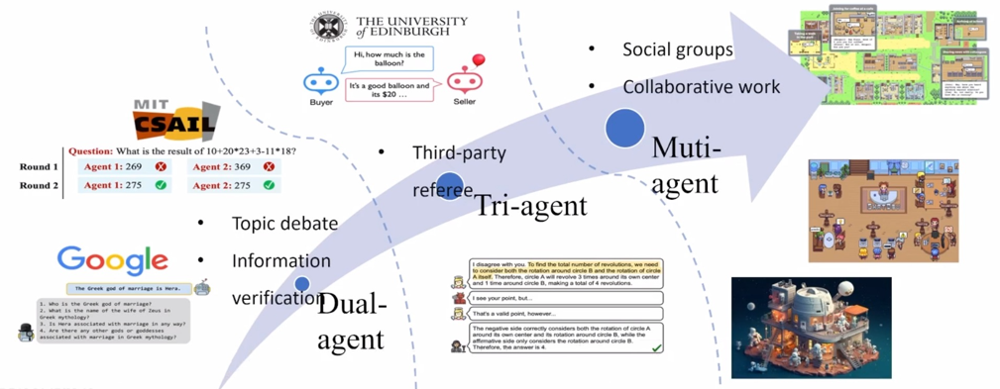

#### **a. 系统架构**
多智能体系统主要有两种架构范式：
*   **社会模拟 (Social Simulation)**：旨在模拟人类社会中的动态交互和行为。智能体被赋予不同的角色、个性和记忆，在一个虚拟环境中自由互动，用于社会科学研究、游戏等领域。
*   **任务解决 (Task Solving)**：旨在通过让多个拥有专门技能的智能体协作来解决一个复杂的、明确定义的任务，例如软件开发、科学研究等。

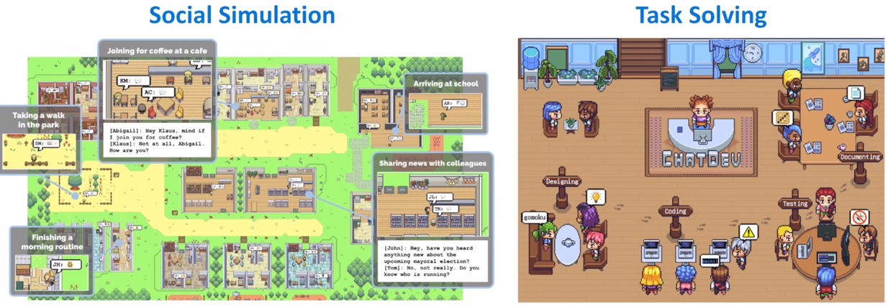

#### **b. 核心问题**
设计一个多智能体系统需要考虑以下核心问题：
*   **目标 (Goal)**：系统是否存在一个共同的、明确的目标？
*   **组织形式 (Organization)**：智能体之间是扁平化的还是层级化的？是否存在管理者和执行者？
*   **关系 (Relationship)**：智能体之间是合作关系、竞争关系还是其他关系？
*   **路由机制 (Routing)**：当一个智能体完成其任务后，信息或控制权应该如何传递给下一个智能体？

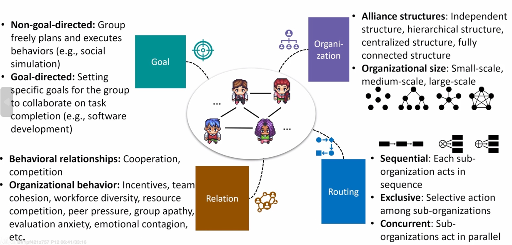

#### **c. 示例：Generative Agents (SmallVille)**

这是一个典型的社会模拟系统。
*   **角色定义 (Role Definition)**：通过精心设计的Prompt Engineering为每个智能体设定独特的背景故事、个性和日常目标。
    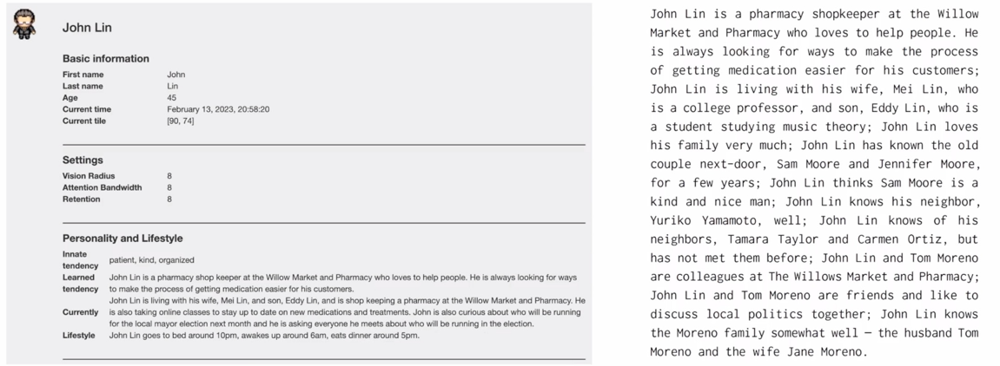
*   **分层规划 (Hierarchical Planning)**：智能体的行为规划分为两个层次：每天早晨制定一个粗粒度的全天计划，然后在执行过程中根据具体情况动态生成细粒度的每小时计划。
    
*   **记忆检索 (Memory Retrieval)**：系统为每个智能体维护一个记忆数据库。当需要决策时，智能体会利用检索增强生成（RAG）技术，结合其历史记忆和当前环境信息，来判断下一步最应该做什么。
    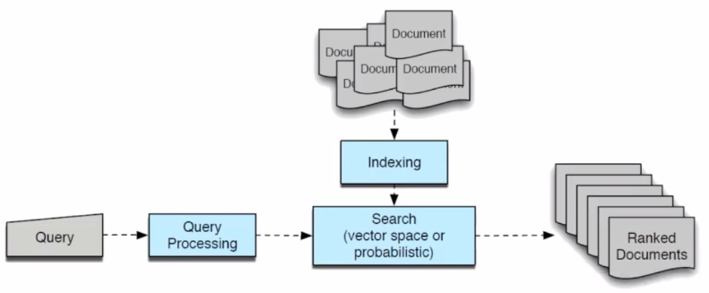
*   **社会行为 (Social Behavior)**：智能体之间会产生自发的社会行为，例如信息的传播（一个智能体观察到的事会告诉另一个智能体）和协同行为（如相约一起活动）。
    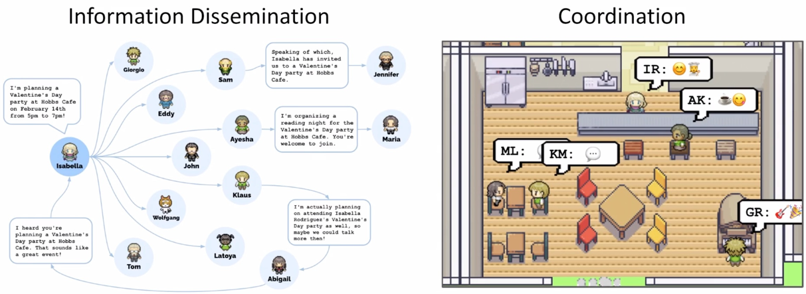

#### **d. 示例：ChatDev**

这是一个典型的任务解决系统，专注于软件开发过程。
*   **聊天链 (Chat Chain)**：ChatDev设计了一个类似于瀑布模型的软件开发流程，包括设计、编码、测试等阶段。每个阶段都由不同角色的智能体负责，形成一个有序的“聊天链”或组织架构。
    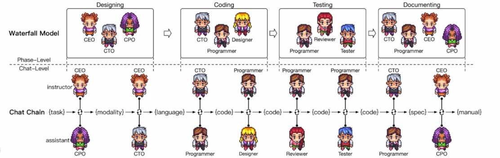
*   **以设计阶段为例**：
    *   **角色设定**：通过Prompt Engineering定义不同角色的智能体，例如CEO、产品经理（CPO）、技术总监（CTO）等，它们共同参与需求讨论和技术设计。
        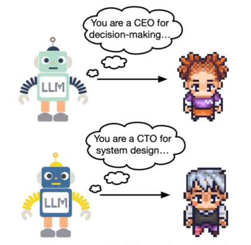
    *   **记忆流 (Memory Stream)**：在协作过程中，所有智能体的对话历史都会被拼接起来，形成一个共享的上下文记忆，确保所有角色都了解最新的进展。
        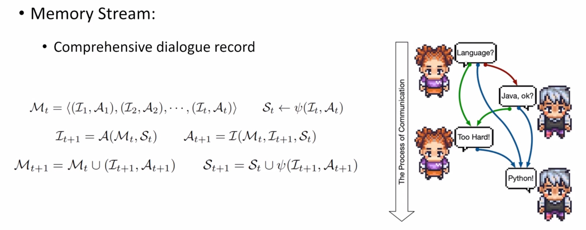
    *   **自反思 (Self-Reflection)**：为了避免在长对话中迷失，ChatDev引入了自反思机制。智能体（例如由“指导者”角色）会定期总结和提取关键决策和结论，作为后续阶段的指导，类似于会议纪要。
        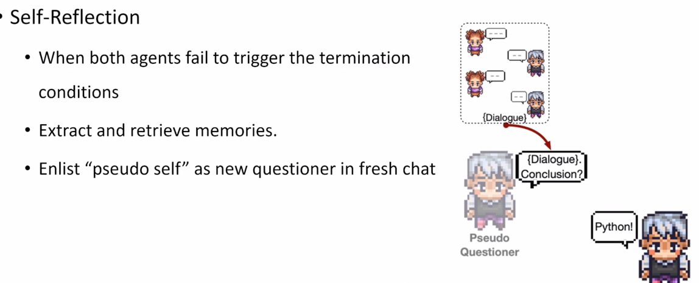

### **4. 未来展望**

自主智能体和多智能体系统的研究仍处于早期阶段，但展现了巨大的潜力。未来的发展方向可能包括：
*   **更强的泛化能力**：开发能够学习并使用任意新工具和API的智能体。
*   **更优的规划算法**：研究更先进的规划和决策算法，使智能体能够应对更长周期、更复杂的任务。
*   **动态的协作策略**：让多智能体系统能够根据任务变化动态地调整组织架构和协作模式。
*   **人机协同**：探索人类如何更自然、更高效地与自主智能体及多智能体系统进行交互和协作。
*   **安全与对齐**：确保智能体的行为符合人类的价值观和意图，防止其产生有害行为。
